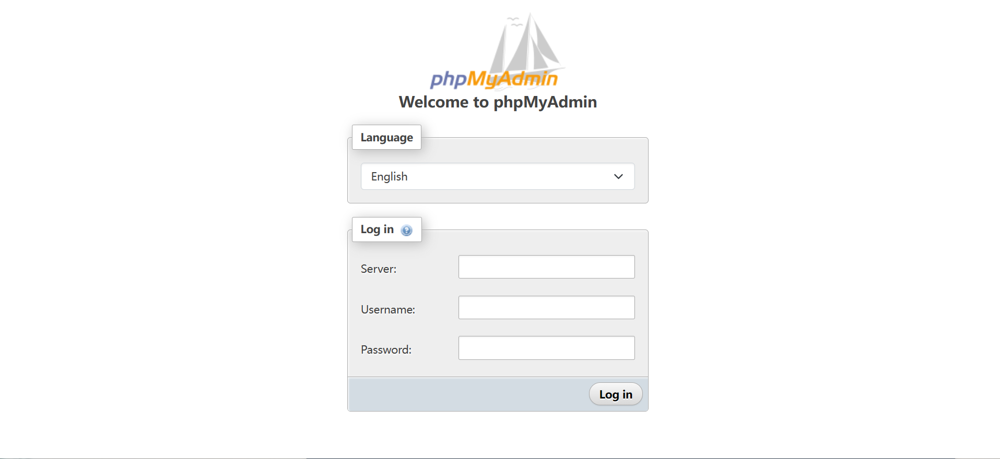
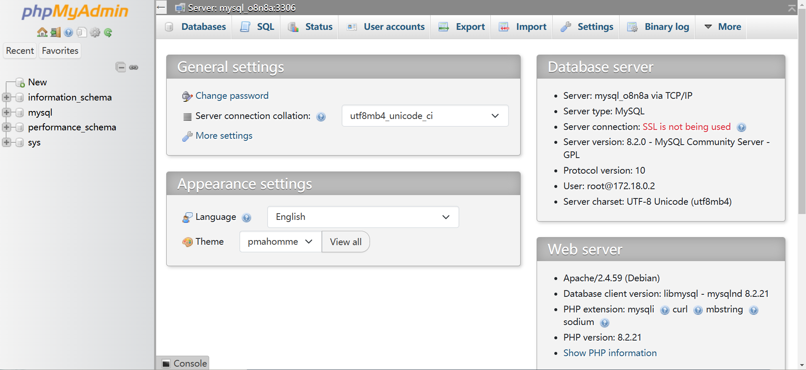

import Meta from './_include/phpmyadmin.md';

<Meta name="meta" />

## Getting started{#guide}

### Initial setup{#wizard}

1. When completed installation of phpMyAdmin at **Websoft9 Console**, get the applicaiton's **Overview** and **Access** information from **My Apps**  

2. Enter the login screen of phpMyAdmin and enter the information of the connected MySQL/MariaDB
   
   - Server: MySQL host name, supports both intranet and extranet connections.

     - Intranet connection: Intranet IP/container name/service name.
     - Extranet: Host URL provided by the cloud database vendor

   - Account: root

   - Password: database password

     

3. After login, you can easily manage the database and run SQL.

   

### Manage database.

- Change Password: **phpMyAdmin Home > General settings > Change password**
- New database: **phpMyAdmin left menu > New**
- New User: **phpMyAdmin Top Menu > User accounts**
- Backup Restore: **phpMyAdmin top menu > Import or Export**
- Enable Remote Access: **phpMyAdmin Top Menu > User accounts**, edit the user's **Login Information**, in the Host name option, select **Any host**, click **Go** to take effect

## Configuration options{#configs}

- Multilingual(✅)
- Configuration file: */etc/phpmyadmin/config.user.inc.ph*

## Administer{#administrator}

* By default, phpMyAdmin restricts the import file size. You can change this limit by modifying the `UPLOAD_LIMIT=20M` in the .env file

## Troubleshooting{#troubleshooting}

