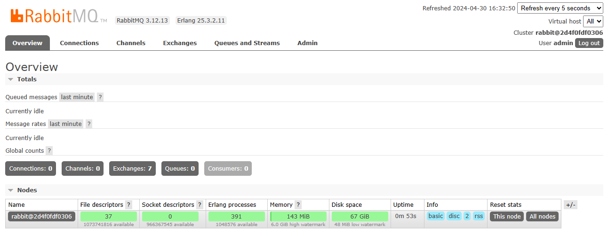

import Meta from './_include/rabbitmq.md';

<Meta name="meta" />

## Getting started{#guide}

### Initial setup{#wizard}

1. When completed installation of RabbitMQ at **Websoft9 Console**, get the applicaiton's **Overview** and **Access** information from **My Apps**  

2. After successful login, you will enter the RabbitMQ console interface
   

### Remote connections

RabbitMQ has remote connectivity enabled by default, but ensure when accessing the RabbitMQ service through a local client (e.g: [QueueExplorer](https://www.cogin.com/mq/index.php)):

- The port for remote access must be open
- The login account must be set with **Tags** (equals to assigning roles)

### Creating users

The RabbitMQ console supports the creation of users. Remember that when creating a user, setting **Tags** for the user. 

### Configuring TLS/SSL in the container

To configure TLS/SSL for RabbitMQ, the following three steps are required:

1. Download the requested certificate to the `/etc/rabbitmq/ssl` directory of the RabbitMQ container  

2. Configure the file `/etc/rabbitmq/rabbitmq.config`

    ```
    ssl_options.cacertfile = /etc/rabbitmq/ssl/ca_certificate.pem
    ssl_options.certfile   = /etc/rabbitmq/ssl/server_certificate.pem
    ssl_options.keyfile    = /etc/rabbitmq/ssl/server_key.pem
    ssl_options.verify     = verify_peer
    ssl_options.fail_if_no_peer_cert = false
    ```

3. Takes effect after restarting the RabbitMQ application


## Configuration options{#configs}

- Configuration file directory (mounted): */etc/rabbitmq/conf.d*
- Multi-user(✅): added by the console
- container port:
  - 15672: RabbitMQ console
  - 5672: AMQP port
  - 4369: Erlang port
- CML: `rabbitmqctl`
- [API](https://www.rabbitmq.com/dotnet-api-guide.html)

## Administer{#administrator}

- Upgrading: [Upgrading RabbitMQ](https://www.rabbitmq.com/upgrade.html)

- Reset the password: In the RabbitMQ container, run the command `rabbitmqctl change_password admin newpassword`

## Troubleshooting{#troubleshooting}

