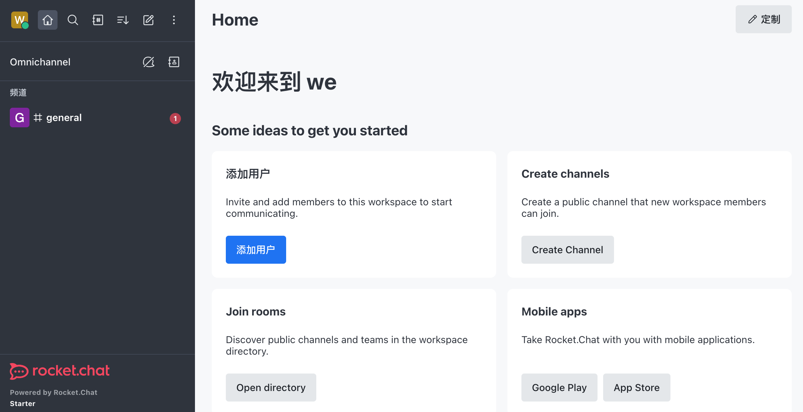

import Meta from './_include/rocketchat.md';

<Meta name="meta" />

## Getting started{#guide}

### Initial setup{#wizard}

1. When completed installation of Rocket.Chat at **Websoft9 Console**, get the applicaiton's **Overview** and **Access** information from **My Apps**  

2. Visit the URL using your local computer browser and go to the initialization page.

3. Follow the guide to create: Administrator Account/Organization Creation/Workspace, etc.

4. After verifying the Workspace email address, go to the backend.
   

## Configuration options{#configs}

- SMTP(✅): Console **Administration > Workspace > Settings > Email > SMTP**

## Administer{#administrator}

## Troubleshooting{#troubleshooting}

