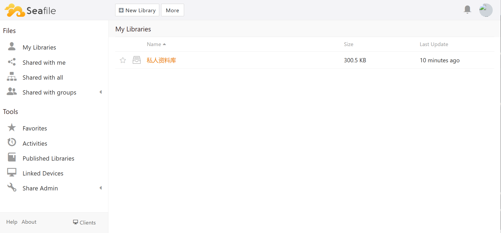

import Meta from './\_include/seafile.md';

<Meta name="meta" />

## Getting Started {#guide}

### Initial Setup {#wizard}

1. After completing the installation of Seafile in the **Websoft9 Console**, retrieve the application's **Overview** and **Access** information from **My Apps**.

2. Access Seafile through your local browser and enter the Seafile login page.

3. Enter your username and password to log in to the Seafile backend management interface.
   

4. Navigate to **System Administration > Settings** and ensure that the URL of Seafile is correct. Otherwise, file upload and download may not function properly.

### Document Editing and Previewing {#docs}

1. Install ONLYOFFICE Docs or Collabora Online through the Websoft9 App Store.

2. Add the connection configuration to `seahub_settings.py` and restart the app for the changes to take effect:
   - [ONLYOFFICE Docs](https://cloud.seafile.com/published/seafile-manual-cn/advanced_setup/only_office.md)
   - [Collabora Online](https://cloud.seafile.com/published/seafile-manual-cn/advanced_setup/libreoffice_online.md)

## Enterprise Edition

### Why Buy Through Websoft9?

Websoft9 is a Seafile Enterprise Edition partner. Purchasing through Websoft9 offers users:

- At least a 10% discount on the paid version
- More comprehensive product support
- Integration with additional technologies like Web Disk, Cloud Storage, etc.

### Activate License

Place the license file in the license directory (mounted), and restart the application for the changes to take effect.

## Configuration Options {#configs}

- Configuration file (mounted): `/shared/seafile/conf/seahub_settings.py`
- License repository directory (mounted): `/shared/seafile`
- SMTP (✅): [Settings](https://cloud.seafile.com/published/seafile-manual-cn/config/sending_email.md) via configuration file, takes effect after restarting the application.
- Mobile support (✅): Same as computer login URLs.
- Multilingual (✅)
- Multi-user (✅)
- Document sharing (✅)
- Document preview and editing (requires third-party middleware)

## Administration {#administrator}

- Reset password: Edit the user in the _EmailUser_ table of the database, update the password field to the following value, and the password will be reset to `123456`:

  ```
  PBKDF2SHA256$10000$7289a20ae4fc2329415b0645fa3d106019cc61952ae1bc2f9eeef7b30dc47d88$5418ac28f06bd84f2bb701a10dbea6b0bd30676c8042e1f73b9ce12aac302a8d
  ```

- SERVICE_URL: Seafile console open: **System Management > Settings > URL**

- Modify email notification signature: Seafile console open: **System Management > Settings > Branding**

## Troubleshooting {#troubleshooting}

#### Seafile can't upload files?

Check if the Seafile URL matches the actual one!

#### Seafile cannot edit and preview files?

- Ensure that document middleware such as ONLYOFFICE Docs has been configured properly.
- Ensure that the Seafile URL matches the actual one.

#### Document security token not properly formed?

Description: After completing the ONLYOFFICE Docs configuration, Seafile Edit and Preview displays the error **Document security token not properly formed**.
Reason: ONLYOFFICE Docs security settings do not match.
Solution: Modify the environment variable `JWT_ENABLED` in the ONLYOFFICE Docs `.env` file and set it to `false`.
