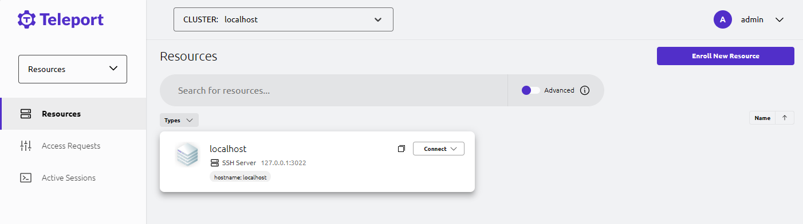

import Meta from './_include/teleport.md';

<Meta name="meta" />

## Getting started{#guide}

### Follow up steps for installation(necessary){#create-user}  

After installing Teleport on the **Websoft9 console**, the following steps need to be completed in order to login to the background:  

1. Ensure have set domain for Teleport and enable HTTPS access (**Required**)  

2. Modify the Teleport configuration file *public-addr* configuration item to your own real domain name (keeping port 443), and rebuild the application.  
   ``` 
   public_addr: 
      - 'example.domain.com:443' 
   ``` 

3. Run the following command in the Teleport container to create a super user and also produce a registration link (URL) 
   ``` 
   tctl users add admin --roles=editor,auditor,access --logins=root,ubuntu,ec2-user 
   ``` 
   > -- logins=root,ubuntu,ec2 user are required, otherwise you will not be able to connect to the managed Linux later on 

4. Run the registration link in local browsing to complete password settings 

   > If the link is inaccessible or unsuccessful, it indicates that steps 1-2 have not been completed or there is an issue   
   
   

5. Use the credentials to login to the Teleport console 
   
   

### Manage resources  

#### Connecting to remote Linux  

1. Login to the Teleport console, select **Resource > Enroll New Resource**

2. Select an operating system and generate a client installation link  
   
   

3. Login to the remote Linux server, copy the previous link for client installation  

4. After client successful installation, return to the Teleport console. Teleport will automatically detect the client and prompt the user to follow the wizard to complete the next steps  

   

## Configuration options{#configs}

- Configuration file in Teleport container (mounted to src directory): */etc/config/teleport.yaml*
- Multilingual (x) 
- IP: Port access method (x): Not support this because self generated certificate is not secure 
- Two Factor authentication: Websoft9 have disabled Two Factor authentication in the Teleport configuration file

## Administer{#administrator}

## Troubleshooting{#troubleshooting}

#### After filling in the password, registration still failed?  

Ensure that the registration link is accessed through HTTPS. 

#### Failed to connect to the server by IP:Port?  

Details: When adding resources, run the installation command on the connected server and display curl failed to verify   
Reason: The self signed certificate has been identified as insecure and connection is not allowed  
Solution: Configure a domain name for Teleport and apply for a public certificate

