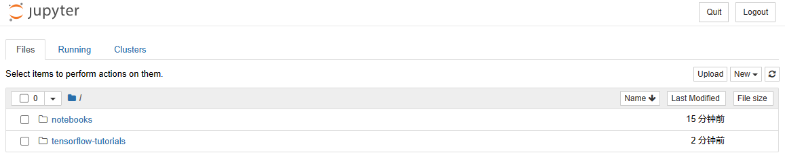

import Meta from './_include/tensorflow.md';

<Meta name="meta" />

## Getting started{#guide}

### Initial setup{#wizard}

1. When completed installation of TensorFlow at **Websoft9 Console**, get the applicaiton's **Overview** and **Access** information from **My Apps**  

2. Access Jupyter URL locally prompts for a login token

3. Login to the Jupyter backend with a Token or set a password
   

### Run TensorBoard

1. Open the Jupter backend in sequence: **New > Python 3 (ipykernel)**

2. Refer to [Using TensorBoard in Notebooks](https://tensorflow.google.cn/tensorboard/tensorboard_in_notebooks),and run the example programs in sequence.Add a parameter`--host 0.0.0.0` to the last command (to allow external access).

3. The TensorBoard is now displayed in the Notebook.
   

## Configuration options{#configs}

- Container Ports

  - 8888: Jupter port
  - 6006: TensorBoard port

## Administer{#administrator}

## Troubleshooting{#troubleshooting}

#### TensorBoard not visible in Notebook?

- Ensure that the TensorBoard command is started with the `--host 0.0.0.0`
- Ensure the host port for container 6006 port mapping is enabled.

