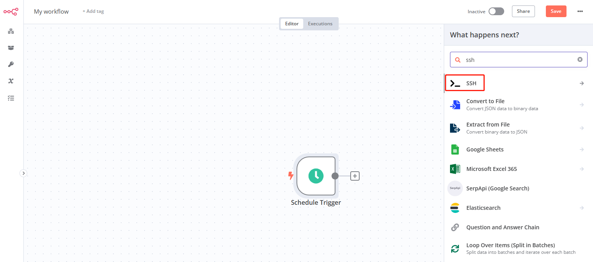

# Schedule jobs

A skilled user knows when and how to schedule tasks to be executed at specific intervals, whether they're recurring or happen a set number of times. You can apply this skill in many scenarios, such as scheduling backups, collecting system logs periodically, or automating basic and repetitive tasks.  

Websoft9 suggest user use **n8n** to replace the [Linux Crontab](https://www.redhat.com/sysadmin/linux-cron-command) that need more skills and not have monitor interface.  

Below is a guide tell user how to run schedule tasks at Linux.  

## Prepare

- Logint to **n8n** console, click **Credentials** of left memu to add SSH credential
- Upload your Linux script of tasks (optional)

## Create schedule tasks workflow to Linux{#server}

1. Login to n8n, and create new workflow

2. Select **On a schedule** for your trigger at  **Add first step**

3. Then, use **ssh** template for your task
   

4. Select **Execute a command** as your action

5. Add server **credential** for this workflow

6. Add your jobs command or script path

7. Click **Test workflow** to verfiy this job

## Create schedule tasks workflow to container{#container}

This workflow is the same with [Create schedule tasks workflow to Linux](#server), you just need use `docker exec` commands