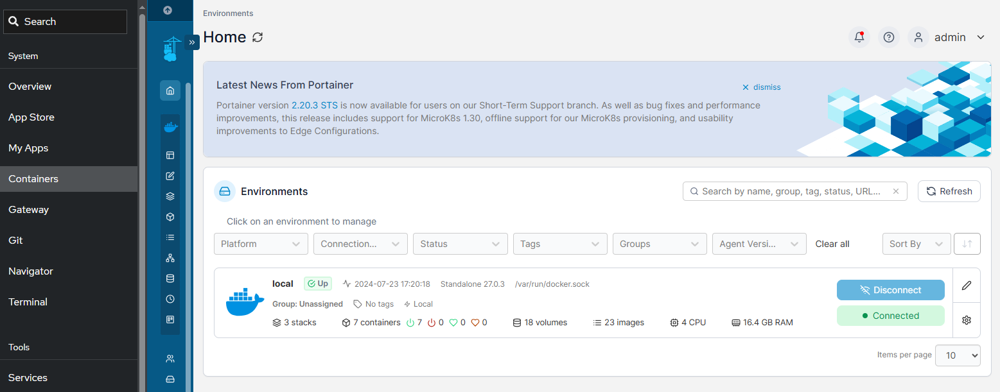

# Manage containers resource

The applications hosted by Websoft9 is based on containers, so user need to be familiar with container state and resource management.  

There are several container management tools:  

- [docker client commands](https://docs.docker.com/engine/) 
- [docker compose](https://docs.docker.com/compose/)
- [Websoft9 Containers](./portainer): Integrated Portainer for container mangement platform
   

## Running container

Websoft9 is fully Docker-compatible, so users can deploy applications consisting of multiple containers directly using [Docker compose templates](https://github.com/Websoft9/docker-library) without relying on the Websoft9 Console.  


## Upgrade containers

You can use Docker Compose to Upgrade containers by below commands

```
docker-compose down
docker-compose pull
docker-compose up -d
```

## Clear container logs

```
# Get the logs path in container
docker inspect --format='{{.LogPath}}' Container_Name

# Clear the logs
echo "" > log_path
```