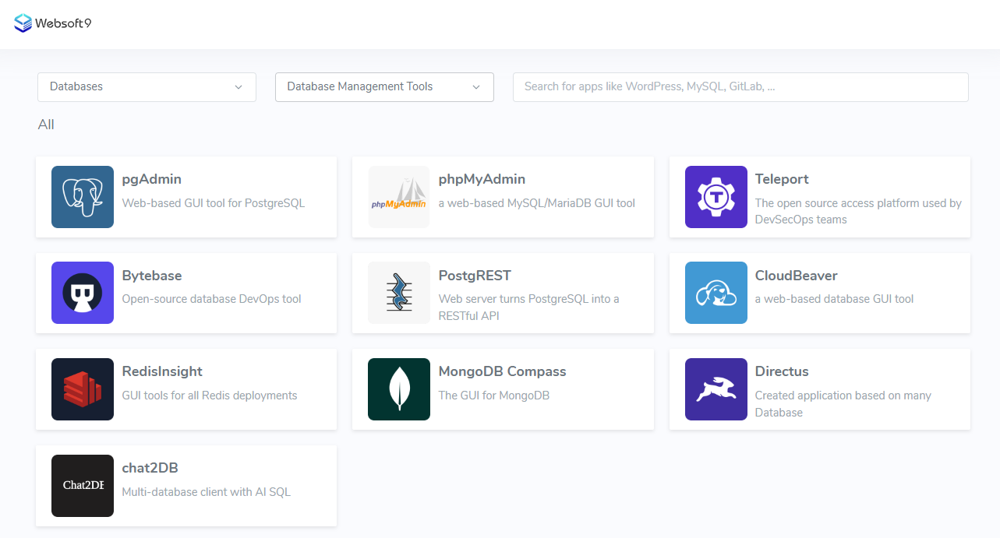

# Deploy database tools

Websoft9 platform provides a wealth of **Online database management tools** that support common functions such as import/export, backup, SQL query, visualization, user management, access control and database auditing, ensuring that users can choose the most suitable management solution.  

## Deploy datbase tools

1. Login to Websoft9 Console, and enter to **App Store**

2. List **Databases > Database Management Tools** catalog
   

2. Select and [Install](./deployment#appstore) one database tool you want to use

## Related topics

- [Deploy database service](./createdb)
- [Connect and manage database](./connectdb)
- [Integrate external database instances](./externaldb)

