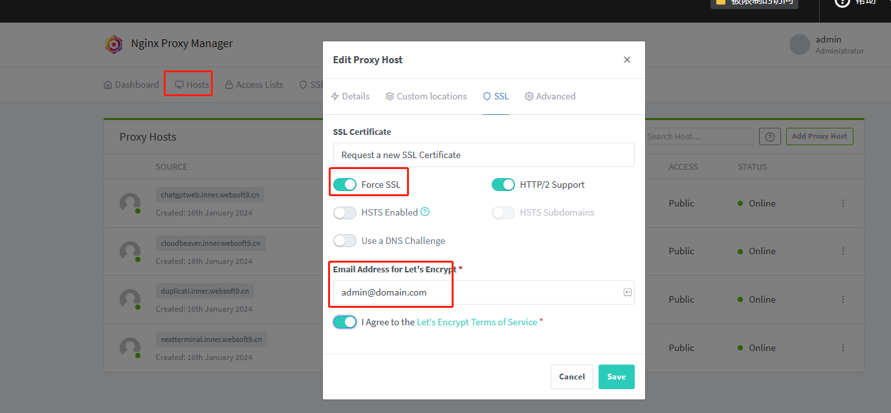
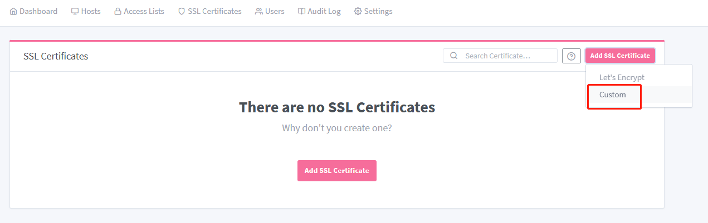

# Set HTTPS for application

HTTPS stands for HyperText Transfer Protocol Secure. It is an extension of HTTP (HyperText Transfer Protocol) and is used for secure communication over a computer network, particularly the Internet.  

User can set HTTPS which support [Let's Encrypt](https://letsencrypt.org/) for application from graphic interface of Websoft9 Gateway.    

## Prerequisites

Necessary:   

- Enable **80,443** port of Security Group of your server
- Complete the [domain binding](./domain-set.md) and user can access application by HTTP

Optional:   

- [Upload your SSL Certificates](#upload) to  Websoft9 Gateway

## Set HTTPS from Websoft9 Gateway{#console}

1. Login to Websoft9 Console and open the **Gateway** interface

2. Go to **Hosts > Proxy Hosts** list all proxy

3. Edit the target proxy and open the **SSL** tab to start set HTTPS

   - SSL Certificate: Suggest select **Request a new SSL Certificate**
   - Force SSL: Suggest don't enable it
   - Email Address: Fill your email to receive notifications of SSL

   

4. Click **Save**, it will starting SSL automaticlly

5. If failed, check your email and network, then try again

## Set HTTPS from external Gateway

Below is the common notes for HTTPS settings from [External Gateway](./gateway-integration)

1. Ensure that the external gateway and the server where the application is located can communicate with the intranet
2. Container application ports need to be exposed to the host machine

## Related resources

- Free SSL platform: [ZeroSSL](https://zerossl.com/), [Let's Encrypt](https://letsencrypt.org/) 

## Related guide

### Set HTTPS with CDN{#cdn-https}

If you use [CDN](./gateway-cdn) with HTTPS, the following principles need to be followed

- CDN to Websoft9 Gateway need HTTPS
- Websoft9 Gateway to application container need HTTPS
- All HTTPS points need use the same certificates

### Upload certificates Websoft9{#upload}

You can upload your certificates to Websoft9 Gateway for proxy hosts:

1. Login to Websoft9 Console, and go to **SSL Certificates** interface of **Websoft9 Gateway**

2. Open the **Add SSL Certificate > Custom** to upload certificates
   

### HTTP redirect to HTTPS

1. Login to Websoft9 Console and open **Websoft9 Gateway** interface

2. Edit the target application **Proxy Host**, open the **SSL** tab and checkmark **Force SSL**

## Troubleshoot

#### Can I enable HTTPS in container?

Technically possible, but not as convenient as a Websoft9 Gateway