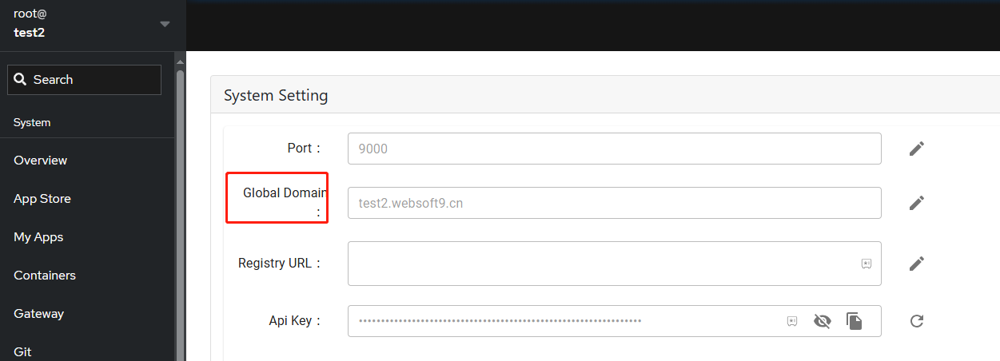
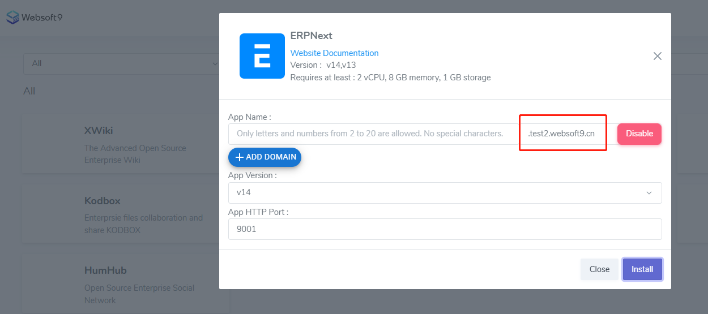
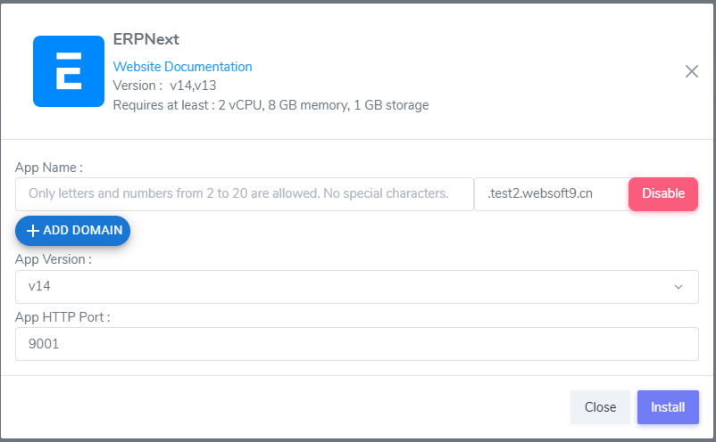
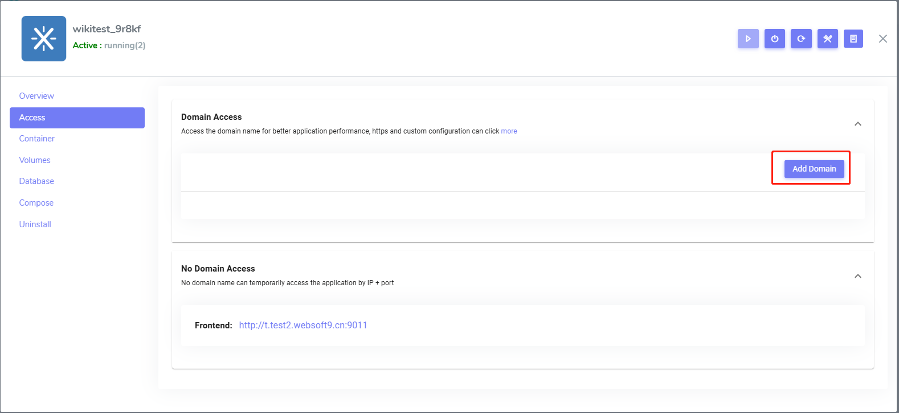
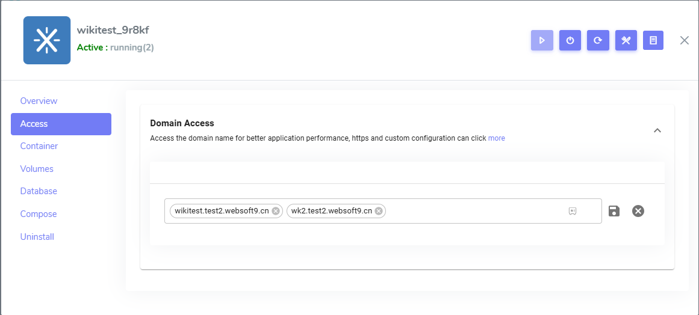
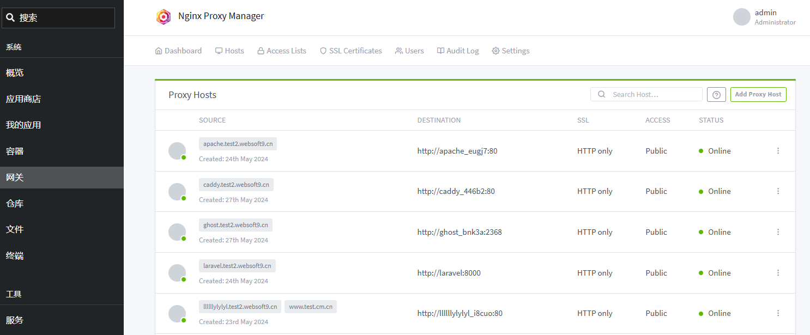
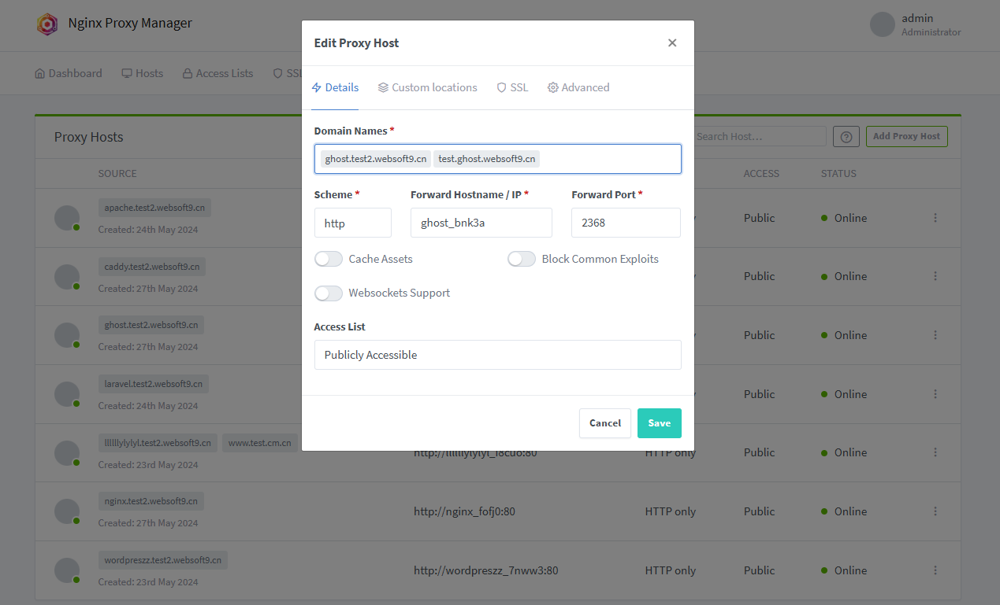

import DocCardList from '@theme/DocCardList';
import {useCurrentSidebarCategory} from '@docusaurus/theme-common';

# Set domain for application

User can set domain for applications at [Websoft9 Gateway](./get_started) or access managment page of **My Apps**, it includes:   

- Configure global domain
- Binding domain for application
- Change domain binding for application
- Delete domain binding

## Prerequisites

- [Prepare domain name](./domain-prepare)
- Enable **80,443** port of Security Group of your server

## Configure global domain{#wildcard}

Websoft9 supports [Wildcard Domain](./domain-prepare#wildcard), automatically generates independent subdomains for each application.  

This method of configuring a domain name is defined as a **global domain name** which only needs to do domain name resolution and binding once, and can be used by all applications, the specific steps:  

1. Add **wildcard domain resolution** at your DNS console, below is sample

   - **Domain Name**: `websoft9.cn`
   - **Record type**: A
   - **Record**: *.inner
   - **Record value**: Internet IP of server

2. When completed the wildcard domain resolution, you can testing subdomains suffixed with `inner.websoft9.com`
   ```
   ping app1.inner.websoft9.com
   ping app2.inner.websoft9.com
   ping app3.inner.websoft9.com
   ```

3. Login to **Websoft9 Console**, click **Settings** on the left memu, add `inner.websoft9.com` to global domain name item.  
   

4. Install any application from **Websoft9 App Store**, there have automaticlly create subdomain `appname.inner.websoft9.com` 
   

5. When completed the installation of application, you can access subdomain for this application.  

## Configure single domain{#app-domain}

If not set [global domain](#wildcard), user need to resolve and bind domain for every application, this method of configuring a domain name is defined as a **single domain for application**. 

For configuring a domain name to application, you just need a A record.  

User can configure single domain at one of two points:  

- When installing the application (Recommendation)
- After installing the application: This method is mean replace application URL, sometime need extra configurations


### When installing the application{#pre}

1. Login to Websoft9 Console and open the **App Store**

2. Go to **Install** interface and click **+ADD DOMAIN** button to add your domain like `erpnext.websoft9.cn`
   

3. The domain can be automatically bindding to the application when completed installation

### After installing the application{#after}

1. Login to **Websoft9 Console** and open the **Access** tab of application management interface from **My Apps**

2. Click **Add Domain** button, add one or more domain (Enter key to confirm each domain name)
   

3. Save and redeploy application, then take effect

## Edit/Delete domain binding{#edit}

You can edit or delete any domain binding for your application, it have two methods:  

### From Websoft9 My Apps{#appmanage}

Edit domain binding from **Websoft9 My Apps** is convenient for user

1. Login to **Websoft9 Console** and open the **Access** tab of application management interface from **My Apps**

2. Add/Delete one or more domain (Enter key to confirm each domain name)
   

3. Save and redeploy application, then take effect

Every domain binding operation from **Websoft9 My Apps** will synchronize to **Websoft9 Gateway**.  

### From Websoft9 Gateway{#gateway}

Edit domain binding from **Websoft9 Gateway** requires administrator

1. Login to Websoft9 Console, open the **Hosts > Proxy Hosts** of **Gateway**
   

2. Edit your tagert domain binding
   

3. Save it and take effect

Every domain binding operation from **Websoft9 Gateway** will not synchronize to **Websoft9 My Apps**, so should know this.    

## Related topics

- [Manage application Base URL](./url)
- [Set HTTPS acccess for application](./domain-https)

## Troubleshoot

#### Global domain exist with single domain?

Yes

#### Can I disable global domain?

Yes, you can disable it at install application interface