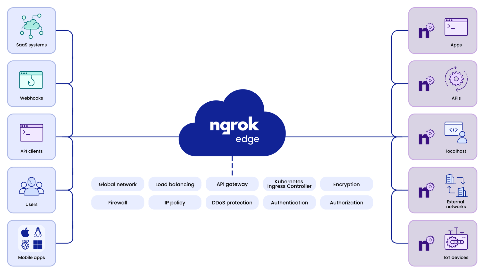

# ngrok reverse proxy

[ngrok](https://ngrok.com/) is a globally distributed reverse proxy that secures, protects and accelerates your applications and network services, no matter where you run them. You can think of ngrok as the front door to your applications.

## Integrated with Websoft9

Three steps to integrate ngrok with Websoft9:  

1. Register account [ngrok](https://ngrok.com/)

2. Install ngrok at your host machine and configure it

3. Excuse `ngrok` command to create access URL for any application to Internet

## Related topics

- [ngrok docs](https://ngrok.com/docs/what-is-ngrok/)
- [SSH Tunneling and Proxying by ngrok](https://www.baeldung.com/linux/ssh-tunneling-and-proxying)