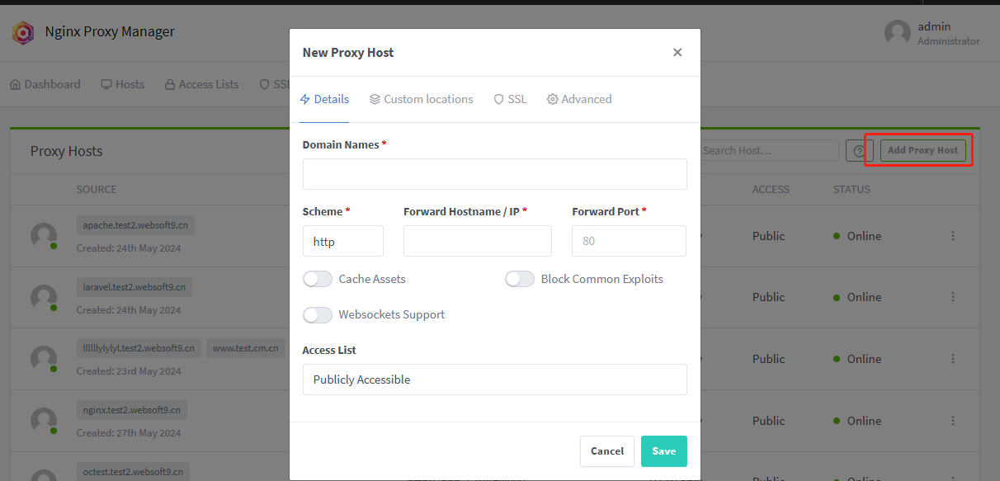
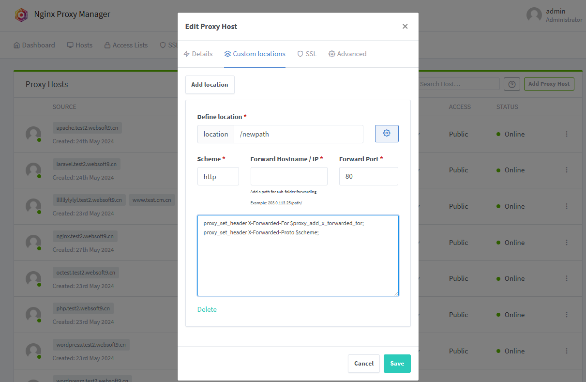

# Set proxy for backend service

When you deploy an application using the Websoft9 App Store, the platform automatically generates reverse proxy-based domain bindings for your application.   

For backend services that not deploy from Websoft9 App Store, you can set up proxies manually to publish them.  

Websoft9 supports two types of reverse proxy services:  

- [HTTP reverse proxy](#http)
- [TCP/UDP reverse proxy](#stream)

## Prerequisites{#pre}

- Enable **80,443** port of Security Group of your server

- Get the **hostname and port** of backend service

  - For container service, if use network **websoft9**, the **container_name** is hostname 
  - For not container service, **[docker0 network bridge](#gateway)** is hostname
  - You need to specify the type of protocol used by the backend service, whether it's HTTP or TCP/UDP

## Create HTTP/HTTPS proxy{#http}

**Proxy Host** is the function module for HTTP/HTTPS proxy at Websoft9 Gateway.  

### Add HTTP proxy (bind domain){#create}

1. Login to Websoft9 Console, open **Hosts > Proxy Hosts** of Gateway

2. Click **Add Proxy Host** to create a proxy

   - **Domain Names**: One or more domains

   - **Scheme**: Protocol of backend service

   - **Forward Hostname** is backend service hostname, **Forward Port** is backend service port

   

3. Click **Save**, a proxy server {} have added to Websoft9 Gateway


### Set customized location block{#proxy-location}

User cat add or modify customized location block at Websoft9 Gateway

1. Login to Websoft9 Console, edit the target **Proxy Hosts** of Gateway 

2. Open the **Custom Locations** tab, fill in **location**, **Forward Hostname** to create new NGINX location
   

3. Click **Gear icon** to add your customized command-line 
    ```
    #proxy_pass http://$server:8080; 
    proxy_http_version 1.1;
    proxy_set_header Host $http_host;
    proxy_set_header X-Real-IP $remote_addr;
    proxy_set_header X-Forwarded-For $proxy_add_x_forwarded_for;
    proxy_set_header X-Forwarded-Proto $scheme;
    ```
4.  Click **Save** will take effect

### Customized global server block

User cat customize a exist proxy server {} block at Websoft9 Gateway

1. Login to Websoft9 Console, edit the target **Proxy Hosts** of Gateway 

2. Open the **Advanced** tab to set it, below is sample that will cover the default **location /** values

    ```
    location / {
            add_header       X-Served-By $host;
            proxy_set_header Host $host;
            proxy_set_header X-Forwarded-Scheme $scheme;
            proxy_set_header X-Forwarded-Proto  $scheme;
            proxy_set_header X-Forwarded-For    $proxy_add_x_forwarded_for;
            proxy_set_header X-Real-IP          $remote_addr;
            proxy_pass       $forward_scheme://$server:$port$request_uri;
            proxy_set_header Upgrade $http_upgrade;
            proxy_set_header Connection upgrade;
        }
    ```

### Enable SSL{#https}

Refer to: [Set HTTPS at Websoft9](./domain-https)

### Setting access control

Refer to: [Set security access for application](./domain-auth)

## Create TCP/UDP proxy{#stream}

**Streams** is the function module for TCP/UDP proxy at Websoft9 Gateway.  

### Prepare

- [Expose more ports to host machine for websoft9-gateway container](./backend-service#proxy-bind-port)
- Ensure that the container allows external access from  `0.0.0.0` or enable whitelist

### Add proxy for TCP/UDP

1. Login to Websoft9 Console, open **Hosts > Streams** of Gateway

2. Fill in correct informations

   - **Incoming Port**: Host machine port that expose from **websoft9-gateway** container
   - **Forward Host**: Backend service hostname
   - **Forward Port**: Backend service port

## Related guide

### Check docker0 bridge address{#gateway}

docker0 is a virtual network interface created by Docker on the host machine. When Docker is installed and a container is run, Docker sets up a bridge network named docker0. This bridge network allows containers to communicate with each other and with the host machine.

To see the docker0 interface and its configuration, 

- You can use the following commands on a Linux host
  ```
  docker network inspect bridge | grep Gateway
  ```

- Or check it from **Container > Network** at Websoft9 Containers