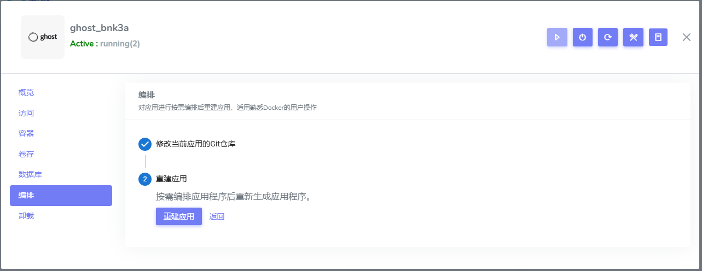
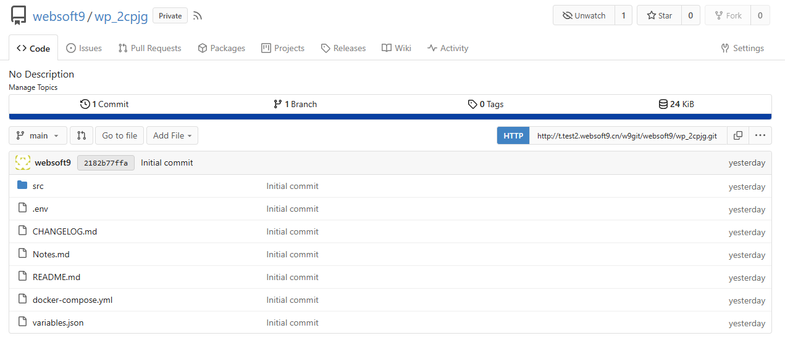

# Update your deployment

Although Websoft9 App Store templates quickly launch applications, they may not meet all user needs.   

The platform allows dynamic update your deployment for customization.

## Concept

Update your deployment is the process to redeploy multi-containers applications. Since the Websoft9 application is based on [Docker Compose](https://docs.docker.com/compose), update deployment is equivalent to customizing a Compose project.  

Docker Compose project is stored as [git repository](./plan-git#modify) at **Websoft9 Git**, the related files includes:  

   - **.env file**: environments for application
   - **docker-compose.yml file**: YAML configuration file all the services defined
   - **src direcotry**:  configuration files or other startup file for application

Modify the items at these files and [Redeploy application](./app-lifecycle#redeploy) will take effective.  

## Get started updating your deployment

### Step 1: Go to edit repository{#edit}

1. Login to Websoft9 Console and open the **My Apps > Application Management > Compose**
   

2. Click the **Go to edit repository** button, it will skip to files browser page of **Git repository**
   

3. Then you can edit any file you want

### Step 2: Customized Configurations{#modify}

You can customized application by git repository file editing interface:

   - **.env file**: environments for application
   - **docker-compose.yml file**: YAML configuration file all the services defined
   - **src direcotry**:  configuration files or other startup file for application

If want to modify environments beginning with **W9_**, you should familiar with [Websoft9 App Store templates rules](https://github.com/Websoft9/docker-library/blob/main/docs/code_owner.md). 

### Step 3: Delete containers (optional){#dynamic}

You can delete exist containers of application if you want to a fully new application:

1. Login to Websoft9 Console, and click **Containers** menu

2. Delete below resources
   
   - Delete all containers by **Stack** memu
   - Delete all container volumes by **Volumes** memu

### Step 4: Rebuild the application services{#dynamic}

1. Go to the **Compose** tab of application management of Websoft9 My Apps

2. Click the **[Redeploy](./app-lifecycle#rebuild)** button and waiting for new services take effective

## Related docs

- [Docker Compose](https://docs.docker.com/compose/)
- [Websoft9 App Store templates developer Guide](https://github.com/Websoft9/docker-library/blob/main/docs/code_owner.md)

## Troubleshoot

### Environments doesn't take effect?

**Description**: When I change `MYSQL_PASSWORD` value at .env file of MySQL applicaton, it not take effect  
**Reason**: This is normal, and the authors of the MySQL container designed it to be so  

### Orchestration file error modification?

**Description**: I have wrong modification for .env or yml file, can I recover it?   
**Solution**: Yes, all orchestration files based on git repository, you can recover by [git restore](./plan-git#modify)

### Pull images error when redeploy?

You can try it again or pull images before redeploy by `docker compose pull` command on your server.  