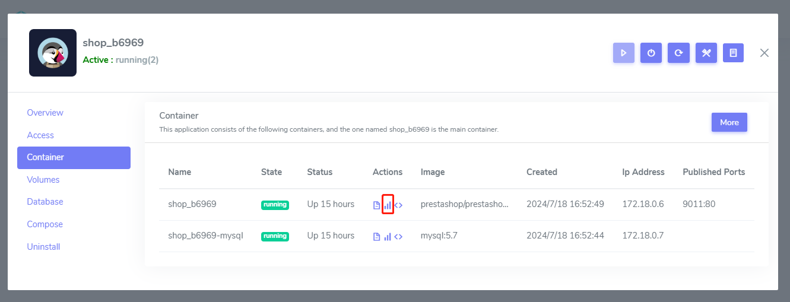
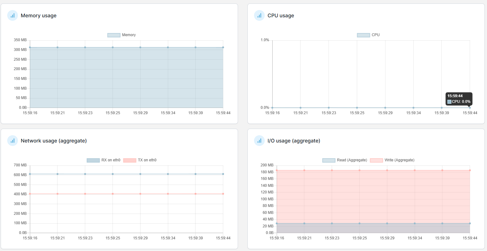

# Show metrics

Websoft9 Console can get the metrics of all containers

1. Login to Websoft9 Console, go the target application manage interface of **My Apps**

2. Click the **Containers** tab, click **ⵏꓲ￨** icon of **Actions** column
   

3. You can see the CPU, Memory and Network usage
   
   