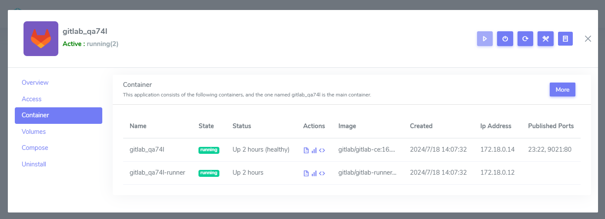
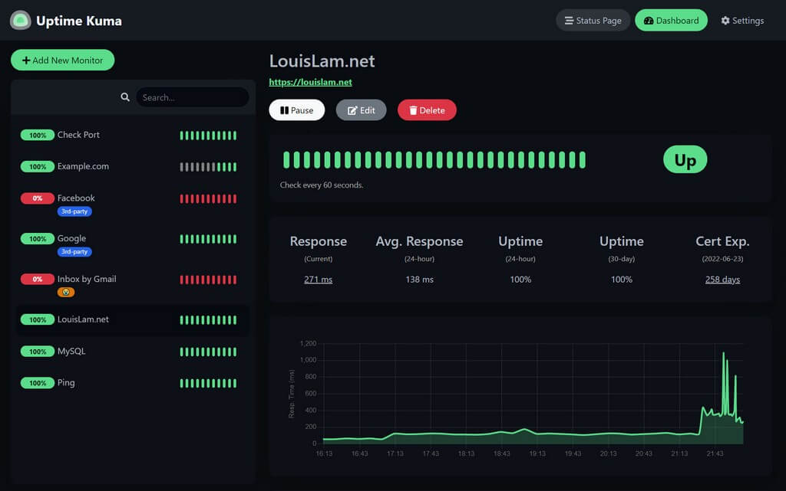

# Manage status and alerts 

Websoft9 provides two aspects of application status monitoring:

- **Container status**: As part of an application, container status reflects its health.
- **Application access status**: Monitor application availability and issue alerts from an accessibility perspective.

## Containers status

1. Login to Websoft9 Console, go the target application manage interface of **My Apps**

2. Click the **Containers** tab, you can see all containers status of this application
   

## Application access status

Websoft9 recommends using [Uptime Kuma](./uptimekuma) from the App Store for application monitoring and alerting due to the availability of high-quality open-source tools.

