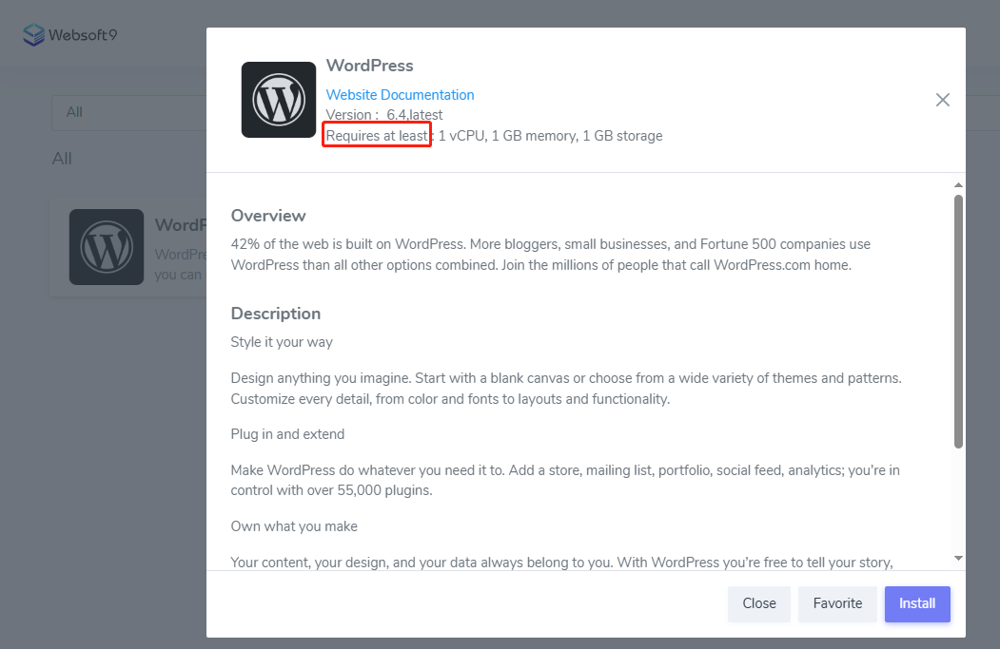
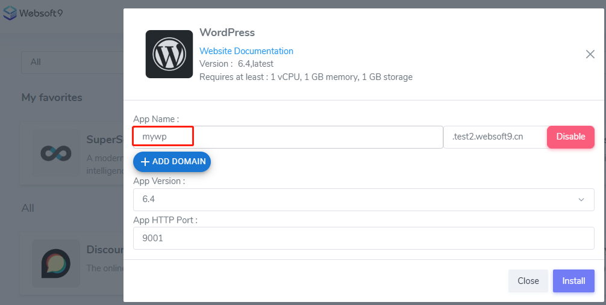
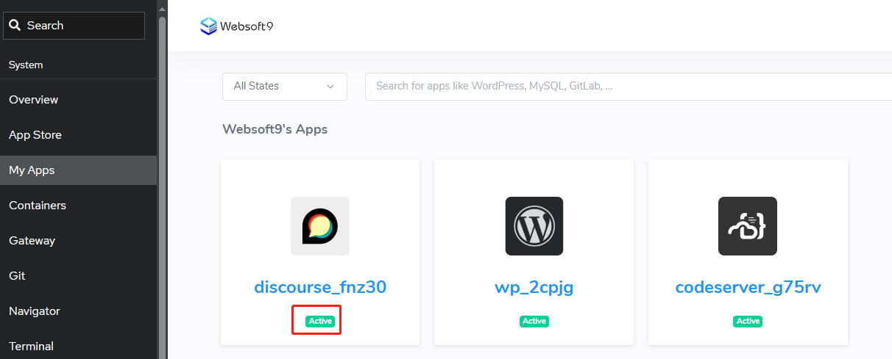
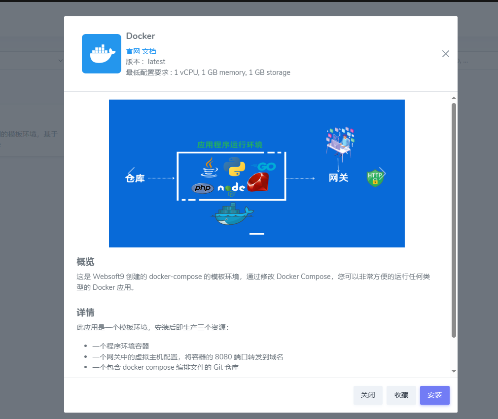

# Deploy Application by Websoft9

Websoft9 supports any type of application deployment methods, includes: templated one-click deployments, Docker image, source code building and binary file
and any other packages

This chapter guides the user in choosing the most effective deployment option based on the different deployments.  

## Features

Websoft9 application deployment is highly innovative compared to peers:

- Follows **install first, configure later** for simplicity with configurable options
- Supports [wildcard domain binding](./domain-set#wildcard), avoiding repeated domain binding
- Compatible with both **domain** and **IP+Port** access modes
- Separates deployment [IaC](https://www.ibm.com/topics/infrastructure-as-code) from application data
- Based on [GitOps](./plan-git#gitops) philosophy for **continuous deployment**
- Supports automated HTTPS certificates and manual uploads
- Non-technical users can deploy apps with ease using Websoft9
- Developers enjoy sufficient permissions and openness of Websoft9

## Prerequisites

- For **domain** access application, you should [Prepare your domain](./domain-prepare) and [Set global domain for Websoft9](./domain-set#global-domain).

- For **IP:Port** access application, you need to open host machine ports (e.g 9001-9999) from **security group**.


## Deploy templated app from App Store{#appstore}

Deploy applications easily from **Websoft9 App Store**, featuring [200+ templates](./#deployment-templates) one-click install application.

1. Login to Websoft9 Console, and [Search templated application from App Store](./appstore.md)

2. Click the target application to display application detail

   

3. Filing or select install parameters

   - **App Name**: It should English string not have any special characters, and it used for App ID and wildcard domain
   - **Version**: Some application have many selection for user and you should know the `latest` may not a stable version
   - **Port**: The port expose to your host machine and it should open at security group of your server
   - **+ Add Doamin**：If have [Set global domain](./domain-set), here not need to add

   


4. Click the **Install** button to start deploy, and it will redirect to **My Apps** interface

5. Waiting for the application status from **Installing** becoming to **Active**, it show install completed
   

## Deploy source from App Runtime{#runtime}

Websoft9 can support deploy from source code such as Java, Python, Node.js, PHP, Go, Ruby, and .NET.   

Refer to: [Deploy source from App Runtime](./runtime)

## Deploy docker image from App Runtime{#image}

Websoft9 support deploy from Docker image, you can refer to below steps if you have read its [concepts](./docker): 

1. Go to the catalog **App Runtime > Docker** from Websoft9 App Store

2. Deploy the **Docker** template
   

3. Filing or select install parameters

   - Container port: It your Docker container port will expose to host machine
   - HTTP port: It is host machine port

4. When you application is running, you can [Update your deployment](./runtime#dockercompose) to replace or add your container service

## Deploy not depend on Websoft9{#os}

You can deploy any software packages or image not depend on Websoft9. The main steps below:  

1. Prepare your [Software packages(artifacts)](./plan-package) compatible with Linux

2. Check you deployment, make sure it not conflict with the following resources

   - port
   - systemd service
   - OS user
   - container 

3. Deploy application step-by-step

4. Add access configuration of Nginx proxy from **[Websoft9 Gateway](./gateway-proxy)**。  


## Troubleshoot

### Access error even if App status is Active?

**Description**: Completed the application installation and the status is active, but access URL is error  
**Reason**: Application container is running, but the services at container is remain starting     
**Solution**: Waiting 1-5 minutes      

### Can I use external db when install?

No, it not support now, you can only [Replace App database](./migratedb) after it running.  


### Some installation timeout?

This is unavoidable. Some application have large Docker image, pull image may timeout.  

### Can I pull image before install?

Yes, you can pull application's all images before installation. Take **wordpress** as example for your reference:  

```
# Copy docker compose library to host machine
docker cp websoft9-apphub:/websoft9/library  /tmp/applibary

# list all applications
ls /tmp/applibary

# cd to your target application
cd /tmp/applibary/wordpress

# pull images
docker compose pull 
```