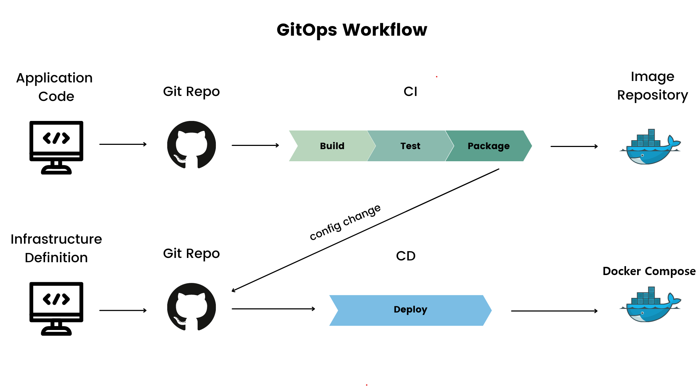
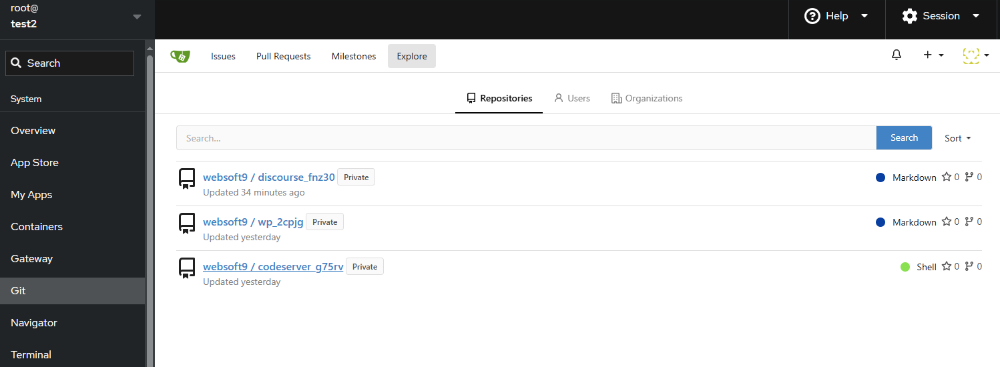
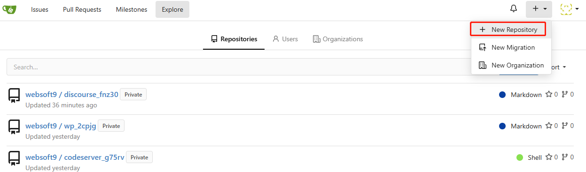
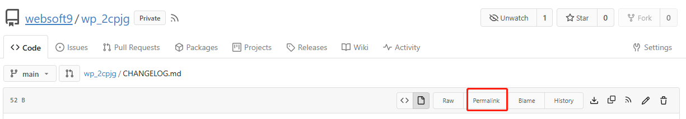
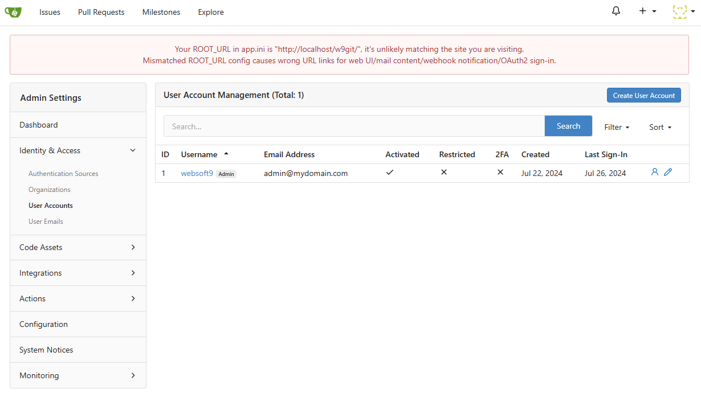
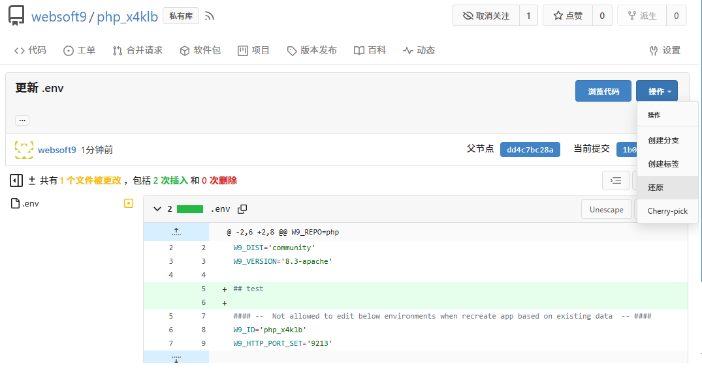

# Use Git for automatic deployment

Websoft9 follow [GitOps Workflow](#gitops) which automates deployment by using Git repositories to manage infrastructure and application configurations, ensuring consistency and version control.

## Benefits from Git deployment{#whygit}

Using Git to manage deployment code, commonly known as [Infrastructure as Code](https://www.ibm.com/topics/infrastructure-as-code), offers clear benefits:

1. **Version Control**: Git's powerful version control tracks and logs every deployment change.

2. **Team Collaboration**: Git supports multiple developers, improving code quality and reducing errors.

3. **Rollback Capability**: Git allows easy rollback to previous states if issues arise.

4. **Automation and Integration**: Git integrates with CI/CD tools, automating processes and speeding delivery.

5. **Audit and Compliance**: Git provides an immutable history, meeting audit and compliance requirements.

6. **Consistency and Standardization**: Git ensures all environments use the same deployment code, reducing discrepancies.

7. **Security**: Git repositories can be configured with access controls to prevent unauthorized changes.

In summary, using Git to manage deployment code is a more scientific choice than managing it directly on servers.

## Git Deployment Workflow{#process}

The below steps is the standard process for Git deployment:  

1. Prepare your server and other infrastructure

2. Prepare [software packages](./plan-package) not limited to docker image, source code, binaries, etc.

3. Add a Git repository includes install workflow and declarative configuration files for automatic deployment

4. Git push trigger the Git deployment workflow

## Tutorial: Use Websoft9 Git{#gitea}

Websoft9 integrated [Gitea](https://gitea.com) as the Git deployment platform and maintain its originality.  

Gitea is a private, fast, reliable DevOps platform that brings teams and developers high-efficiency but easy operations from planning to production.  

### Create Git repository automatically{#auto}

When user install applications from **Websoft9 App Store** or **Websoft9 App Runtime**, it will create a Git repository automatically for this application.  

### Create Git repository manually{#create}

You can create Git repository manually by the following:  

1. Login to Websoft9 Console, and go the **Git** dashboard by the left menu

2. Click **+ New Repository** at upper right to start create a Git repository
   

3. The following settings you should know

   - **Owner**: Select the [user you added](#user)
   - **Visibility**: Private or Public

### Add zip files to Git repository{#zip}

You can add zip file to Git repository for automatic deployment:  

1. Login to Websoft9 Console, and go the **Git** dashboard by the left menu

2. Open the target repository files browser mode

3. Upload zip file to repository from interface or `git push` command

4. Git the **raw** URL of file as download URL for automatic deployment
   

### Add Git users{#user}

There have default user `websoft9` for automatic deployment, but this user is not suitable for customized use case.  

You can add your Git user by the below steps:  

1. Login to Websoft9 Console, and go the **Git** dashboard by the left menu

2. Enter to **Site Administrator > Admin Settings > Identity & Access > User Accounts** from at upper right
   

### Manage Git repository{#manage}

Gitea provides a full range of operations for repositories, including: setting them public or private, authorizing user access, issue management, branch management, and more.  

### Edit and recover files{#modify}

There have many methods for manage files of Git repository, it includes:

- Modify file contents
- Upload file
- Delete file
- Get the raw URL of file
- Recover file from history records

Following steps for you to edit and recover files:  

1. Login to Websoft9 Console, and go the **Git** dashboard by the left menu

2. Open the target repository files browser mode

3. Click the edit icon to modify any file
   

4. Recover file from **Operation > Revert**
   

## Git related topics{#gitops}

- [Gitea docs](https://docs.gitea.com/zh-cn/)
- [gitops.tech](https://www.gitops.tech)
- [A beginner's guide to GitOps and how it works- GitLab](https://page.gitlab.com/resources-ebook-beginner-guide-gitops.html)
- [What is GitOps - Red Hat](https://www.redhat.com/en/topics/devops/what-is-gitops)
- [Is GitOps the next big thing in DevOps? - Atlassian](https://www.atlassian.com/git/tutorials/gitops)
- [What is GitOps: The Beginner's Guide - Splunk](https://www.splunk.com/en_us/blog/learn/gitops.html)
- [What is GitOps? - DigitalOcean](https://www.digitalocean.com/blog/what-is-gitops)

## Troubleshoot

### Can not open Git at Websoft9?

If you can not open Git menu at Websoft9 Console, it can be have **integration problem** caused by the following: 

- Default Email address changed or deleted
- The default user's password has been changed