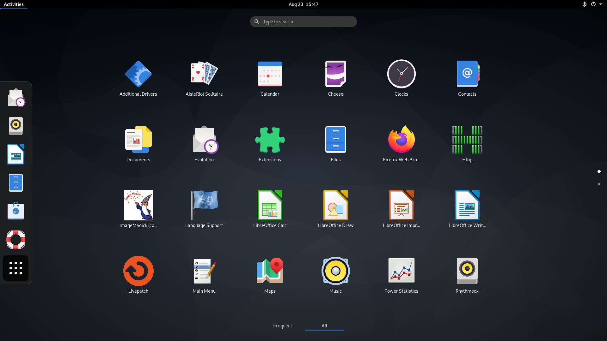
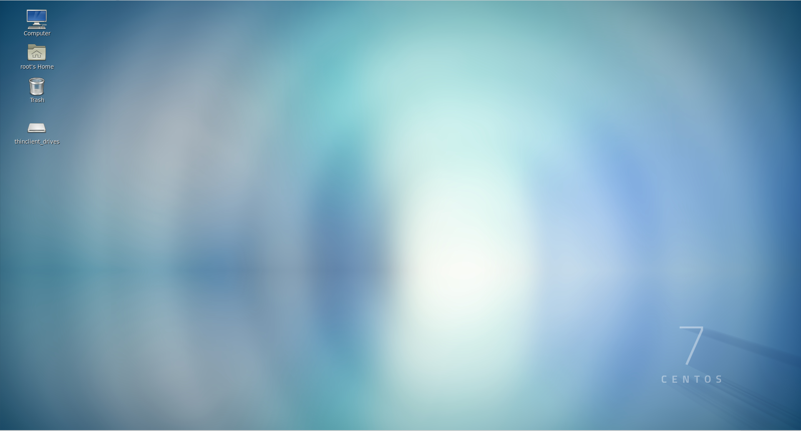
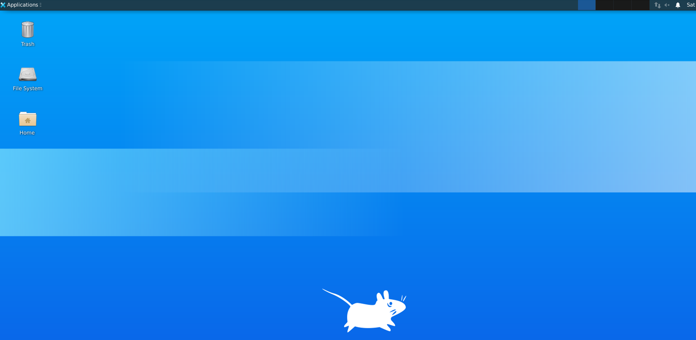
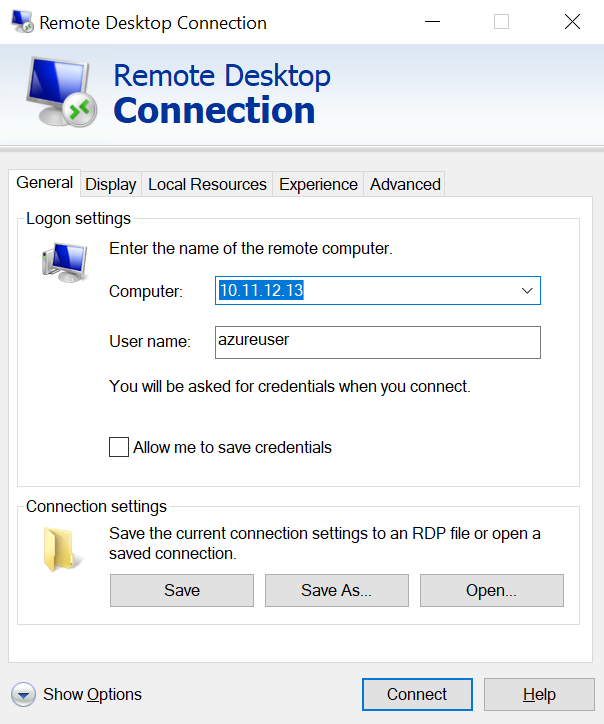
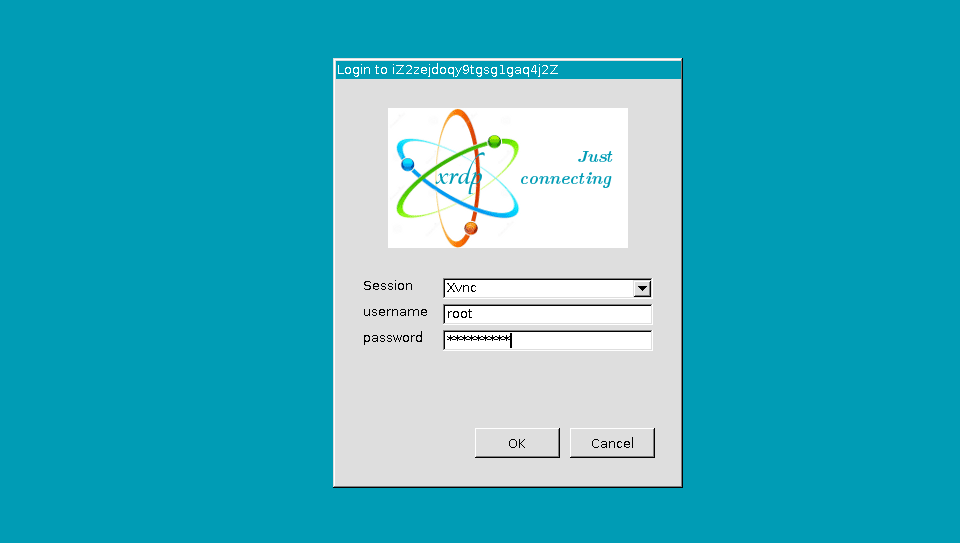
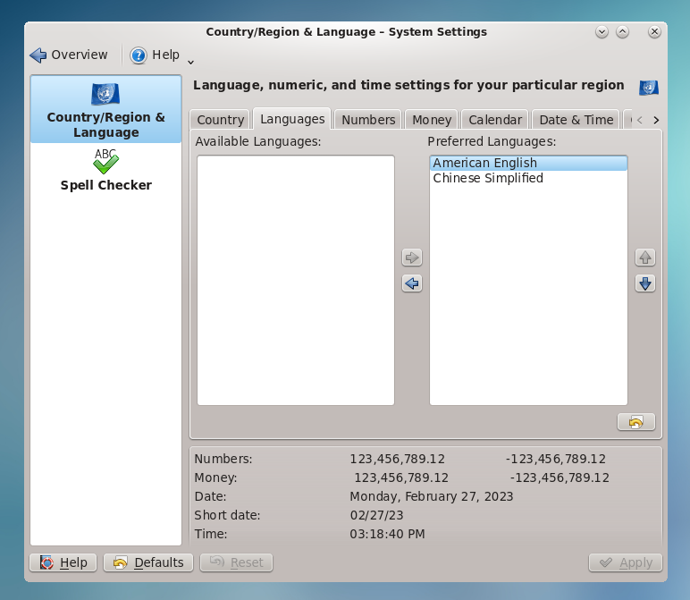

import Tabs from '@theme/Tabs';
import TabItem from '@theme/TabItem';

# Linux

Websoft9 provides enterprise users with Linux system hosting support services to meet the special needs of DevOps and application hosting.   

Linux Desktop image powered by Websoft9 on Cloud platform provides an secure, reliable and flexible virtual workspace for enterprise users, helping companies improve work efficiency, ensure data security and reduce operational costs.   


## Supported Linux images


You can use supported images powered by Websoft9 with technical service at major cloud provider.   

- **Linux server distributions**, like [Oracle Linux](https://www.oracle.com/linux/), Rocky Linux, CentOS7.x
- **Linux with Desktop**, like Gnome, KDE, Mate

   <Tabs>
   <TabItem value="Gnome" label="Gnome" default>
      
   </TabItem>
   <TabItem value="kde" label="KDE">
      
   </TabItem>
   <TabItem value="mate" label="Mate">
      
   </TabItem>
   <TabItem value="Xfce" label="Xfce">
      
   </TabItem>
   </Tabs>

- **Linux with common packages**, like Docker, AI, machine learning


## Remote Desktop for Linux{#desktop}

This paragraph details how to configure a desktop environment and remote desktop (**[XRDP](https://cloudzy.com/rdp-vs-vnc-remote-desktop-comparison/)**) for your Linux VM.


### Prepare

Before connecting to the desktop, you need to know the parameters associated with it

- XRDP server port: 3389
- systemd service
    ```
    # For RDP
    sudo systemctl start | stop | restart | status xrdp

    # For Gnome
    sudo systemctl start | stop | restart | status gdm
    ```
- Set a local user account password
  ```
  sudo passwd your_user
  ```

### Connect Desktop by XRDP

1. Open your local remote desktop client and connect to the IP addressof your Linux.
   

2. Enter the username and password for the user account on your VM as follows
   

3. After authenticating, the xfce desktop environment will load and look similar to the following example
  

### Set languages for Desktop

Three steps for set lanuages for Desktop, below is the sample for KDE:

- Install language packs
   ```
   yum search kde | grep -i chinese
   yum install kde-l10n-Chinese.noarch
   ```
   
- Install fonts
   ```
   yum groupinstall "fonts"
   ```

- Change the default settings by **system settings > Commone Appearance and Behavior > Local > Languages**  
  


## Common reference

### Create user{#createuser}

You can run below commands to create new user and password

```
sudo su 
adduser xxxuser
```

### Enable root account{#enable}

If your `root` account is can not login, please following below stes to enable it

1. SSH connect your Linux

2. Use below commands to set password for root
    ```
    sudo su
    sudo passwd root
    ```

3. Edit file */etc/ssh/sshd_config*  and files at directory */etc/ssh/sshd_config.d*  

   1. Add configuration item: `PermitRootLogin yes` and `PasswordAuthentication yes`
   2. Delete configuration item: `PermitRootLogin no` and `PasswordAuthentication no`

4. Restart SSH server
   ```
   sudo systemctl restart sshd
   ```

### Encoding and Fonts

Encoding and fonts both serve characters, but there are fundamental differences:

- Encoding is the format in which the computer stores all kinds of characters (UTF8, Unicode, etc.), it is a **machine oriented** design form, run the `locale` command to see the encoding.
- Fonts are the formats that computers use to display characters (Google Fonts), and are **human-oriented** design forms.

## Related topics

- [Linux commands](./linux-commands)
- [Container guide for Linux](./guide/container/)

## Troubleshoot{#troubleshoot}

### Can I use VNC to connect desktop?

Yes, but you should install VNC Server at Linux, e.g [TigerVNC](https://github.com/TigerVNC/tigervnc)

### My desktop unlocked?

The login password cannot be unlocked, you can only log in again after restarting the server.  

It is recommended to turn off the screen lock function after logging into the desktop.

Take Gnome as an example, turn it off by **Privacy > Screen Lock** and set **Automatic Screen Lock** to off.  