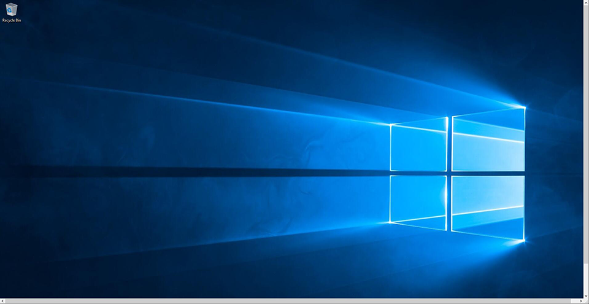
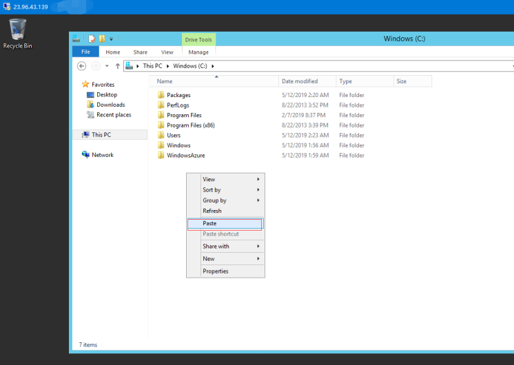

# Windows Server

Websoft9 have the most experience with Microsoft applications in the cloud and we offer the best platform for Windows Server and SQL Server for higher performance and reliability, greater security and identity services, more migration support, the broadest and deepest capabilities, lower total cost of ownership, and flexible licensing options.   

Websoft9 can supports everything you need to build and run Windows applications including Active Directory, .NET, Microsoft SQL Server, Windows desktop-as-a-service, and all supported versions of Windows Server. With our proven expertise, we can help you easily lift-and-shift, refactor, or even modernize your Windows workloads.

## Supported images

You can use supported Windows images powered by Websoft9 with technical service at major cloud provider.   

- Windows with [SQL Sever Express](./sqlserver) 
- Windows with AI and ML
- Windows with [Visual Studio](https://docs.microsoft.com/zh-cn/visualstudio/get-started/visual-studio-ide) for developer

## Tutorial and reference

### Remote desktop for Windows{#connectwindows}

You must meet the following prerequisites to connect to your Windows instance using an RDP client.

1. Install an RDP client
   - Windows includes an RDP client **MSTSC** by default
   - macOS need Download the [Microsoft Remote Desktop](https://apps.apple.com/us/app/microsoft-remote-desktop/id1295203466?mt=12) app from the Mac App Store
   - Linux Use [Remmina](https://remmina.org/)

2. Get the **Internet IP** of Windows Server, and enable **3389** port of Security Group

3. Prepare Administrator (Other) username and password of Windows

4. When finish logging on, you can see Windows screen
   

5. You can copy and paste files from local computer to remote Windows directly
   

### Get Windows logs{#logs}

Refer to [Manage and monitor Windows Server event logs](https://learn.microsoft.com/en-us/training/modules/manage-monitor-event-logs/)

### Windows workloads

- [Containers on Windows](https://learn.microsoft.com/en-us/virtualization/windowscontainers/)
- [MSBuild](https://docs.microsoft.com/zh-cn/visualstudio/msbuild/msbuild)
- [Visual Studio](https://docs.microsoft.com/zh-cn/visualstudio/get-started/visual-studio-ide)

## Troubleshoot{#troubleshoot}

#### Windows container include desktop?

No, Windows container is for DevOps automation

#### Can I install VS to container?

Yes, refer to [build-tools-container](https://docs.microsoft.com/zh-cn/visualstudio/install/build-tools-container?view=vs-2019) and [docker-visualstudio](https://github.com/Websoft9/docker-visualstudio)