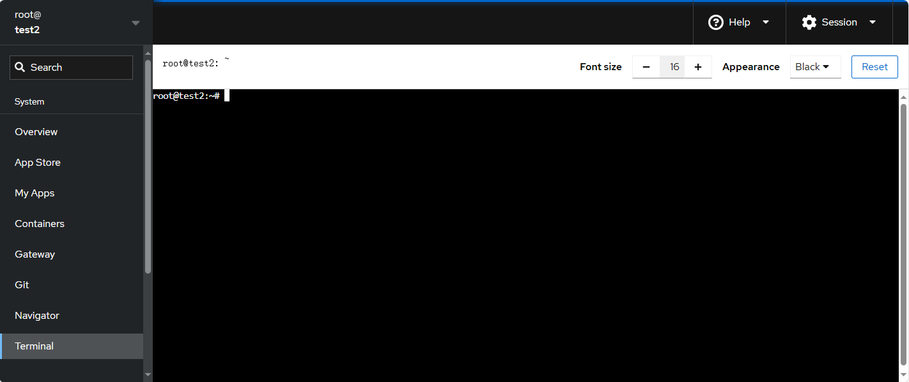
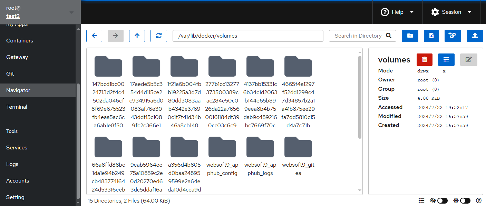

# Connect your server

Below is the main methods for connecting Linux by SSH:

- **Use local SSH terminal**: Need to install to local computer, like Terminus, WinSCP, Putty, Xshell, Tabby, MobaXterm, etc.
- **Web-based SSH terminal**: Not need to install, just use online from Websoft9 Console or Cloud provider Console

Next, we will describe how to use [Web-based SSH terminal](./web-terminal) connect to Linux from the Websoft9 Console.  

## Prepare user account{#osaccount}

Generally the Linux default username is `root`, but on some cloud provider the default account is not the same.  

For more information, see the below table:

   |  cloud provider   |  username   | 其他|
   | --- | --- | --- |
   |  Azure   |  username is set by user when created virtual machine   | [How to enbale root account?](./linux#enable) |
   |  AWS   |  AmazonLinux is `ec2`,  CentOS is `centos`, Ubuntu is `ubuntu`, Debian is `admin`   | [How to enbale root account?](./linux#enable)|
   |  Alibaba Cloud   |  root  | |
   |  HUAWEICLOUD   |  root  | |
   |  Tencent Cloud   |  Ubuntu is `ubuntu`, other Linux distribution is `root`  | |

## Lauch web terminal

### Use a standalone secure web terminal{#third}

We recommend install standalone secure **infrastructure access platform** from Websoft9 App Store to connect server, like [teleport](./teleport) and [Next Terminal](./nextterminal). 

### Use Websoft9 built-in terminal{#inner}

The Websoft9 Console has a built-in web terminal, which allows you to connect to the server where the Websoft9 Console is located (limitation) for command and file operations without confidentiality:

- SSH terminal for connect server the same with Websoft9 Console
    

- File browser for you to manage files online
   

