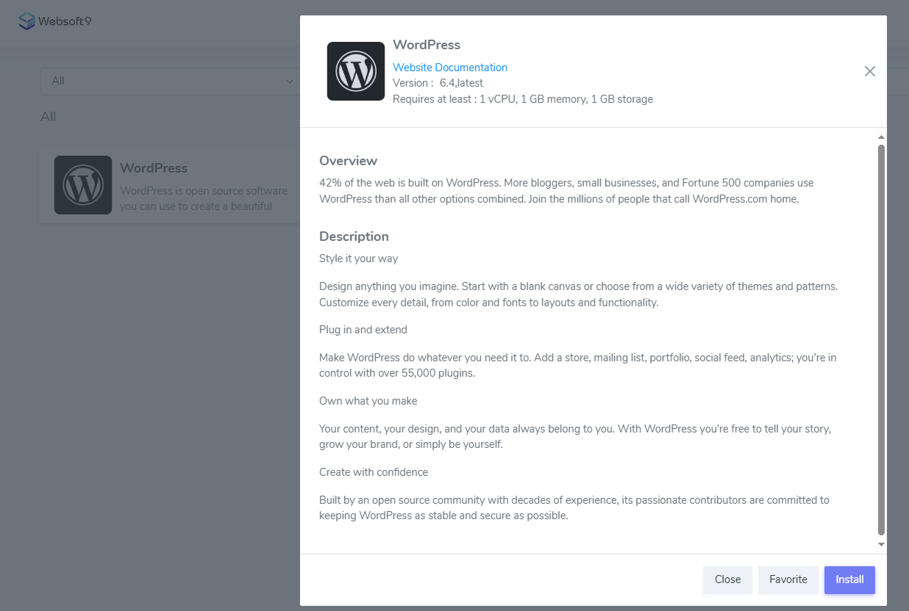
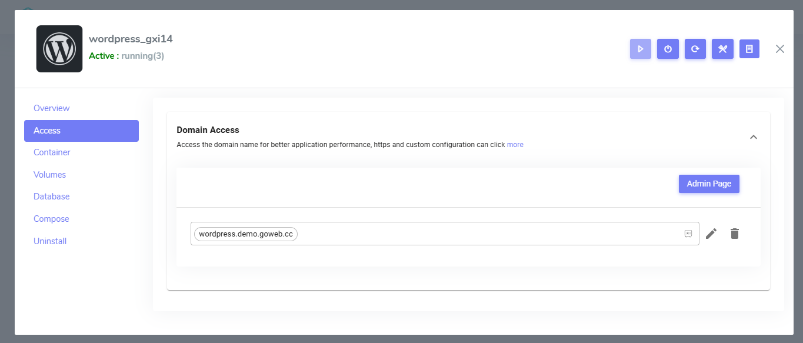

# Hosting your WordPress

Websoft9 offer hosting services optimized to meet the performance and security requirements of [WordPress](./wordpress) sites.  

Here are the professional steps for hosting WordPress on Websoft9:  

## Plan requirements{#plan}

Enterprise WordPress deployments face a number of specialized business requirements and technical challenges:  

- **WordPress multiply sites**: Need to support multiple WordPress sites to meet the needs of business.

- **Multi-language support**

   Three optional multi-language implementations    

   - Automatic Online Translation
   - Page-level multi-language maintenance
   - Deploy each language as a separate site

- **Image and Video Separation**: Separate static resources such as images and videos from the main site

- **Backup**: Provides comprehensive backup solutions, including automatic scheduled backups and manual backups

- **Website Acceleration**: Improves website loading speed and user experience through a variety of technical means (e.g. CDN, caching plug-ins, optimized databases, etc.).

- **Monitoring and Access Statistics**: Monitor the health status of WordPress and sites analysis.  

## Deploy WordPress{#deploy}

You can deploy any number of WordPress sites with a one-click from Websoft9 Console:  

1. Login to [Websoft9 Console](./login-console) and go to **App Store** page

2. Search keyword "wordpress", find and install it
   

3. Wait 1-2 mins until WordPress running

4. Get the access URL from  **My Apps** of Websoft9 Console
   

## Set domain and HTTPS{#domain}

Setting up domain access and automatic HTTPS certificates for WordPress is easy through the Websoft9 Console.  

For more information, see the related chapter:  

- [Set domain and security access for application](./gateway)
- [Set HTTPS for application](./domain-https)

## Monitor WordPress{#monitor}

Websoft9 Console provide monitoring for your WordPress, includes services status, CPU/Memory usage.  

Users are also supported to deploy [Uptime Kuma](./uptimekuma), [Netdata](./netdata) and other monitoring tools from **Websoft9 App Store**.

For more information, see the related chapter:  

- [Monitor your applications](./monitor)

## Site Analytics for WordPress

Although WordPress have statistics plugins, but there are problems with using plugins:

- Uses up computing resources in the WordPress container
- No centralized dashboard for statistics
- The specialization of the plugin is not comparable to that of professional statistics software.

You can install free Open-Source Web Analytics like [Plausible](./plausible), [Umami](./umami), [Matomo](./matomo) from Websoft9 App Store.    

## Support WordPress from Websoft9

Websoft9 Support for WordPress is an extension of your business. Fast, secure, feature-rich hosting that makes your work so much easier. Built for WordPress websites and agencies worldwide.  