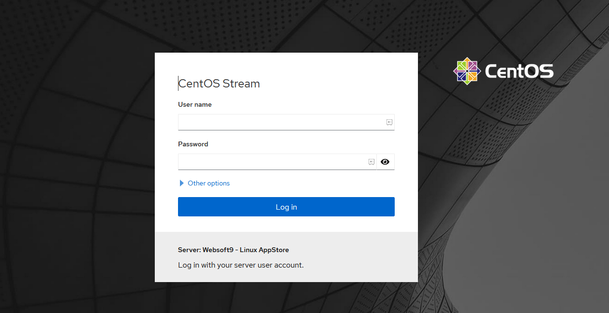
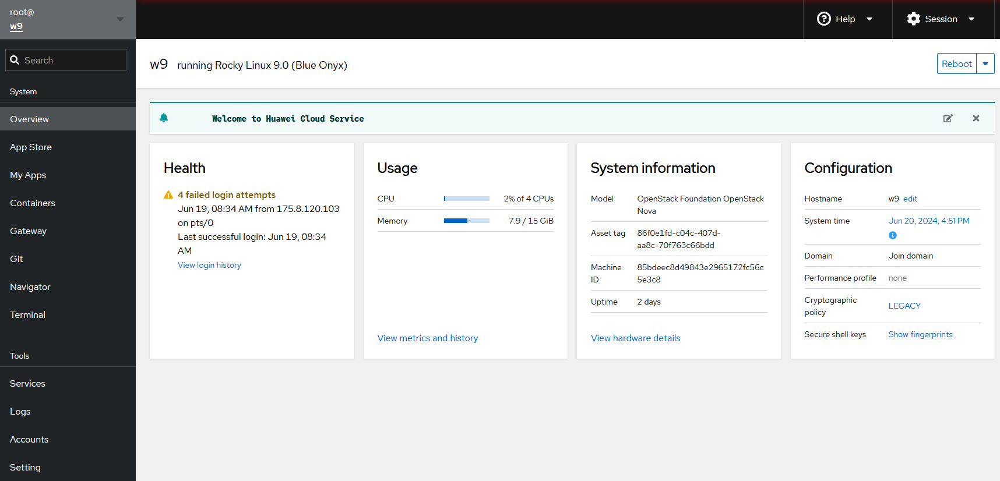
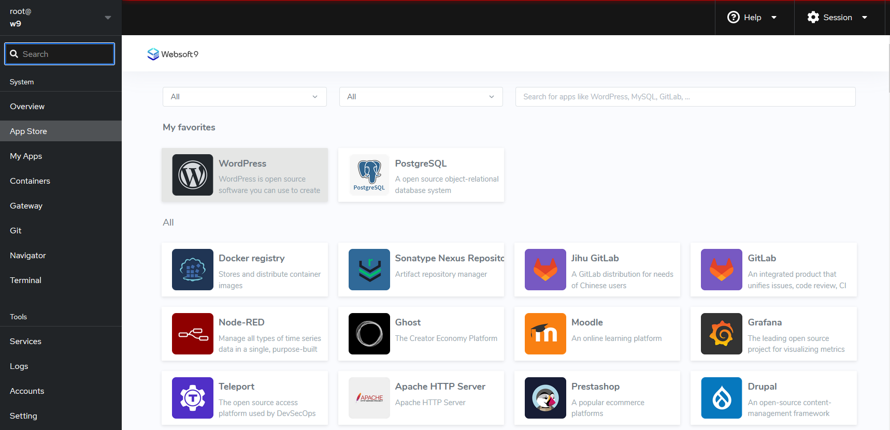
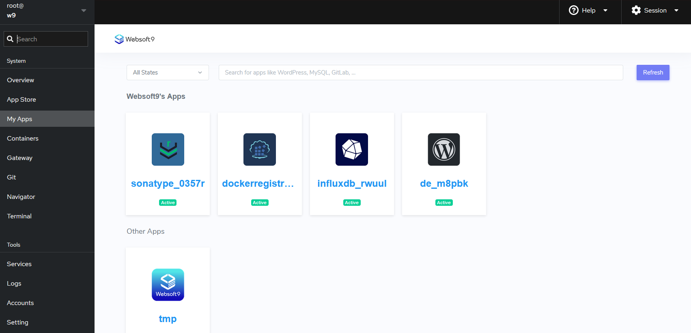

# Login Websoft9 Console

After installing the Websoft9, the next step is to login to the Websoft9 Console.

## Prepare

Below steps is need:  

- Open the inbound ports of Server at your Cloud security group:

   - Required ports: **80, 443, 22, 9000**
   - Optional ports (for application access): **9001-9999**

- Get the Server's [credentials](./credentials) that is shared with Websoft9 Console

## Login

1. Access via local browser: `http://server-public-IP:9000`, the Websoft9 login page
   

2. Input the server's [username and password](./credentials), after a successful login, you will be directed to the console default page.  
 
   - **User name**: The server's administrator account, it is recommended to use `root` for the first login. 
   - **Password**: The server's administrator password.

   

3. Click on **App Store** to view all available application templates.
   

4. Click on **My Apps**to view the list of installed applications.
   

## Related Topics

- [User account and credentials](./credentials)
- [Set Global domains for Websoft9](./domain-set#wildcard)

## FAQ

#### Can login Websoft9 using key pair?

No, you should set password for user account and cany keep key pair for SSH
