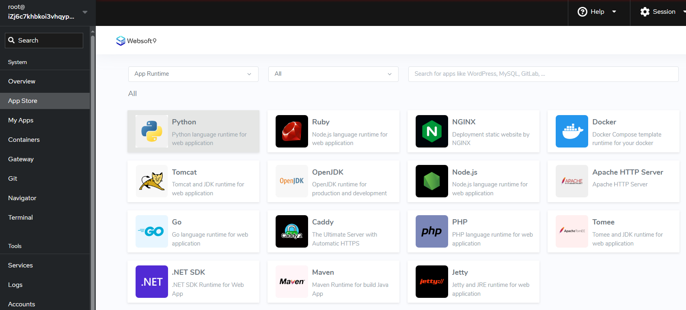
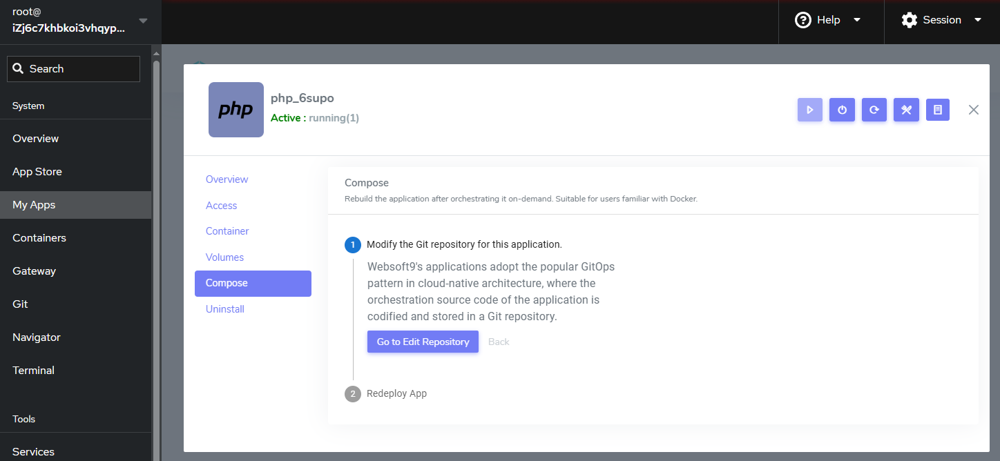
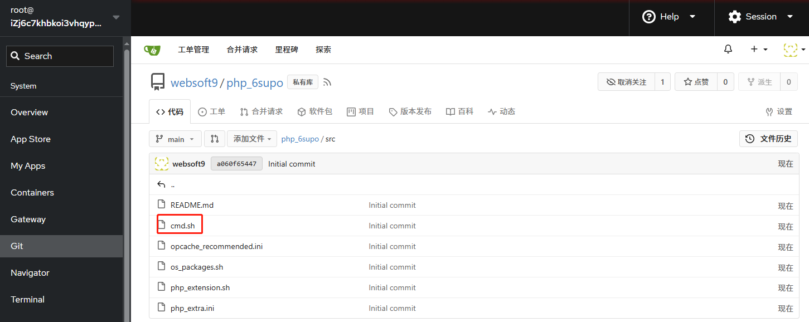

import DocCardList from '@theme/DocCardList';
import {useCurrentSidebarCategory} from '@docusaurus/theme-common';

# Deploy from App Runtime

Websoft9 **App Runtime** enables you to build and host web apps, mobile back ends, and RESTful APIs in the programming language of your choice. It enables automated deployments from GitHub, or any Git repo. It provides a programming language template such as Java, Python, Node.js, PHP, Go, Ruby, and .NET, as well as Docker image and static website deployment.  

## Learn about App Runtime

Understand App Runtime types for use cases and basic configuration parameters.

### Use cases

Websoft9 **App Runtime**  includes below types for different use cases: 

| App Runtime template                                           | Use case                   | 
| -------------------------------------------------- | ---------------------- |
| PHP, Node.js, Java, Python, Ruby, .NET     | Web application, Web development framework  |
| Apache, Nginx, Caddy           | Static website |
| Docker                                    | Docker application    |
| Hugo, Jekyll, Gatsby, Hexo, Next.js | Static website application      |
| Laravel, Django                    | Web framework application         |

### How it work?

App the **App Runtime** templates have the same deployment methods that based on GitOps and [IaC](https://aws.amazon.com/what-is/iac/):  

- After launching the App Runtime, Websoft9 create three resources for user to deploy source code or binary, includes: 

  - Git repository
  - language container
  - server block of Gateway

- Then user can upload install packages and add deployment scripts to language container by updating App Runtime

### Common parameters

These are the common parameters for deployment by App Runtime:  

- Orchestration tool: **docker compose**
- Container Port: 8080
- Dockerfile build: Not support now
- Execute commands at container: Yes
- Automation scripts: 存储在编排文件 *./src/cmd.sh*，挂载到容器的 */usr/local/bin/cmd.sh* 目录
- Character encoding: UTF-8
- Multiply version: 每个语言都支持多版本，合计有几十个可选的版本
- Root directory path: 进入容器后的默认的位置即应用根目录，可运行 `pwd` 查询

  - PHP: */var/www/html*
  - Jetty: */var/lib/jetty/webapps*
  - Tomee: */usr/local/tomee*
  - Tomee: */usr/local/tomcat*
  - Nginx: */usr/share/nginx/html*
  - Caddy: */srv*
  - Apache HTTP Server: */usr/local/apache2/htdocs*
  - 其他环境: */usr/src/app*

### Language specific

Web Runtime 不同的语言环境拥有更多个性的配置: 程序根目录、包管理器、安装扩展、编译、命令行、容器操作系统等。

<DocCardList items={useCurrentSidebarCategory().items}/>

## Deploy application Guide{#guide}

Web Runtime 在 Websoft9 的技术体系中，也是作为一个应用对待，它与 WordPress 这种应用没有本质差异。  

如果已经安装 Websoft9，且绑定了全局域名，那么通过 Web Runtime 运行程序及其简单: 

### Step1: Launch App Runtime

1. 登录 Websoft9 控制台，打开: "应用商店" 的 **运行环境** 类目
   

2. 任选一个环境应用，点击 "安装"  

3. 待安装完成后，一个基于 **容器** 的程序运行环境已经启动。此时，Websoft9 为它创建了三个资源: 

   - 1 个环境容器
   - 1 个网关中的虚拟主机配置，将容器的 **8080** 端口转发到域名
   - 1 个 Git 仓库

### Step2: Customize App Runtime{#dockercompose}

启动环境后，可以根据需求对环境进行定制修改（也称之为应用编排），常见的场景包括: 

   - 替换 docker-compose.yml 默认容器的**镜像标签**，替换 demo 容器，运行目标容器
   - 向 docker-compose.yml 中增加其他容器配置
   - 向 .env 中增加环境变量，并保护前缀为 **W9_** 的环境变量不被破坏
   - 修改 .env 文件中的 W9_VERSION 的值，启用模板化安装中不可选的版本

定制修改后，重建应用后方可生效。

### Step3: Prepare install packages

Web Runtime 需要 **所有安装包都可以被下载**，不建议使用 FTP 或 SFTP 上传代码的方式，这样做的好处: 

- 消除了服务器上的文件操作，避免文件权限问题，更安全可靠
- 便于实现部署自动化

若软件包没有下载地址，需为之创建下载地址。参考教程: [手动创建 Git 仓库以存储软件包](plan-git#create) 

### Step3: Deploy packages to App Runtime

部署安装包从流程上看，主要是围绕目标容器，通过运行命令，完成以下三个步骤: 

1. **上传代码**: 建议将程序代码以压缩包方式下载、解压到容器中的应用根目录
2. **编译构建**: 运行程序所需的编译或构建命令（[提前准备制品安装包](./plan-package)，避免编译操作）
3. **启动程序**: 运行程序的启动命令（确保运行在容器的 8080 端口，并允许外网访问）

Websoft9 为用户提供了两种运行命令的方式，对应两种部署模式:   

#### Manual interactive deployments

手动进入容器中并逐一执行部署命令时，这种操作一般被称为 “交互式部署” 或 “手动部署”: 

1. [进入容器的命令模式](./inner-container#docker-exec)

2. 在容器中运行上传代码、编译构建等准备工作，具体范例参考: 

   - [PHP](https://websoft9.github.io/docker-library/apps/php/src/cmd.sh)
   - [Python](https://websoft9.github.io/docker-library/apps/python/src/cmd.sh)
   - [Ruby](https://websoft9.github.io/docker-library/apps/ruby/src/cmd.sh)
   - [Go](https://websoft9.github.io/docker-library/apps/go/src/cmd.sh)
   - [Node.js](https://websoft9.github.io/docker-library/apps/nodejs/src/cmd.sh)
   - [.NET](https://websoft9.github.io/docker-library/apps/dotnet/src/cmd.sh)
   - [Java with OpenJDK](https://websoft9.github.io/docker-library/apps/openjdk/src/cmd.sh)
   - [Java with Tomcat](https://websoft9.github.io/docker-library/apps/tomcat/src/cmd.sh)
   - [Java with Tomee](https://websoft9.github.io/docker-library/apps/tomee/src/cmd.sh)
   - [Java with Maven](https://websoft9.github.io/docker-library/apps/maven/src/cmd.sh)
   - [Java with Jetty](https://websoft9.github.io/docker-library/apps/jetty/src/cmd.sh)

3. 以 **后台方式启动应用程序** : nohup **Your Command** > output.log 2>&1 &

   - **Your Command** 用实际命令替换，例如: `nohup python manage.py runserver 0.0.0.0:8080 > output.log 2>&1 &`
   - nohup 表示以后台运行，> output.log 2>&1 & 是指定日志路径
   - 程序在后台运行后，可以通过 `cat output.log` 查看日志

4. 如果重启容器，需重新执行第 3 步命令

#### Automated scripted deployment{#auto}

自动化脚本部署是通过预先编写的脚本自动执行一系列部署任务，无需人工干预: 

1. 登录 Websoft9 控制台，进入应用的管理界面的 [编排](../quick/manageapp#reup) 标签页
   

2. 修改编排文件的 *src/cmd.sh* 脚本（它包含范例），**插入个性化命令**或**去掉范例的注释**，
  

3. 启动**重建应用**操作后，脚本被推送到容器中自动运行，直至部署完成。

  > 自动化脚本部署后重启容器会再次执行 *src/cmd.sh* 中的内容，用户应该保证脚本的健壮性防止重启容器时发生错误。

## Updating your deployment

Updating your deployment refers to the process of making changes to an already deployed application or service. This can involve a variety of tasks, including: 

### Changing version

It only need two steps for changing version for App Runtime: 

1. Get the support version from file `variables.json` at your repository

2. Change the value of W9_VERSION at file `.env` 

3. Reploy the application

### Convert to DevOps workflows 

Websoft App Runtime, based on GitOps, easily transforms program environments into developer-friendly DevOps workflows.  

1. Login to Websoft9 Console, and [Add user](./plan-git#user) at **Websoft9 Git**

2. Grant the new user the authority to manage the Git repository

3. Push your source code to Git repository for development

4. Updating deployment for DevOps

   - Add source code volume at file  `docker-compose.yml`
   - Add build commands at  file `src/cmd.sh`

## Troubleshooting

#### Source of container images?

All container images are officially maintained by Docker or provided by the program's original manufacturer, and are 100% native, with no modifications. 

#### How can I customize deployment?

You can customize deployment by these files at application's repository

- `.env`
- `docker-compose.yml`
- `src/cmd.sh`

#### Run multiply apps in one container?

Don't suggest this

#### How to change files permissions?

Execute a command like `chown -R <owner>:<owner> /<path?`

#### How to add startups to container?

You can add your startup commands to container by below methods: 

- Add commands to file `src/cmd.sh`
- Exec to container and running the required process in the background, command like this `nohup  Your CMD here  > output.log 2>&1 &`

#### How can see the process via **nohup**?

Execute a command `jobs`

#### How to delete the running process?

Execute `ps aux` to find the PID, then execute `kill -9 PID`