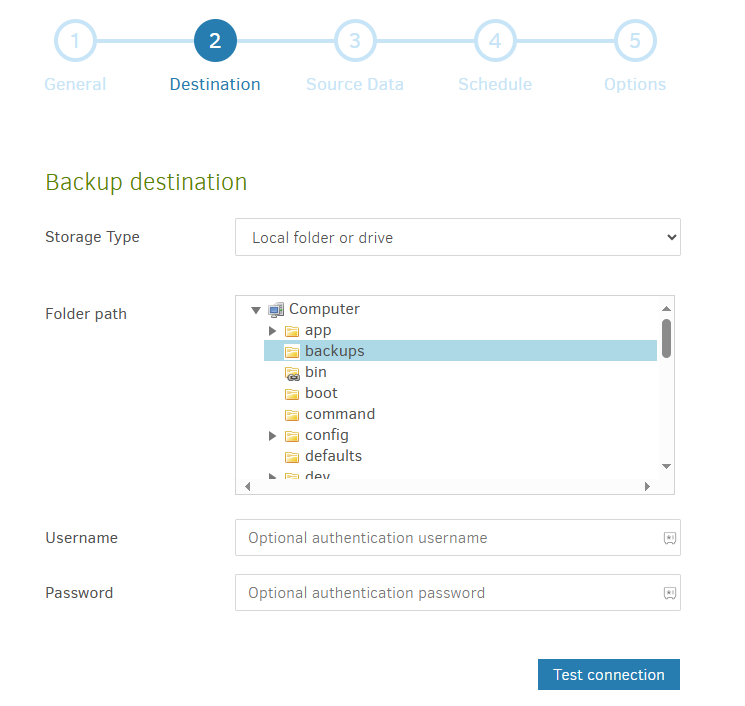
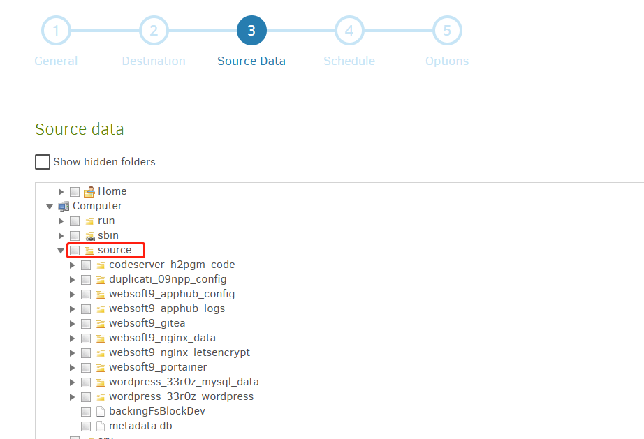
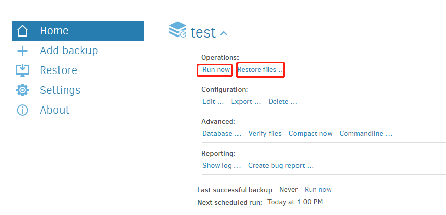

# Backup Websoft9 and Apps

Since Websoft9 is completely Docker-based, once you have backed up Websoft9 and the application's Docker volumes, you have backed up all of your data.   

In addition, there are some apps that come with their own backup features or backup scripts which are preferred for backups, refer to the documentation of the app itself.  

Next, we'll focus on describing a unified backup by backing up a **Docker volume**  

There are both automatic and manual backups:  

## Automation backup for volumes

Use application **Duplicati** to automatically backup and restore Docker volume

1. Install **Duplicati** at Websoft9 App Store

2. Local browser to access **Duplicati** console, and set admin password by **Settings > Access to user interface**

3. Add new backup for your docker volumes by **+ Add backup > Configure a new backup**

4. Important setting items for your references: 

   - **General > Encryption**: You can select **No encryption**

   - **Destination > Storage Type**: Suggest select third-party storage such as s3, SFTP or Azure blob. 
     
     - If select **Local folder**, **Folder Path** must set to path `Computer/backups`
       

   - **Source data**: Select docker volume source object from path `Computer/source`
     
      - Folders starting with `websoft9_` are the data directories of Websoft9 Console
      - Other folders are application directories

      

   - **Schedule**: Any suitable settings 

5. After completing new backup, you can see it at **home** page of Duplicati

6. You can click **Run now** for backup and **Restore files** for restore
   

## Manual backup for volumes

Manual backup is one of the most primitive backup methods, and it is simple and effective in some cases:  

1. Compress **source docker volumes** on your server and download it to another target storage

2. Export your database by DB management tool