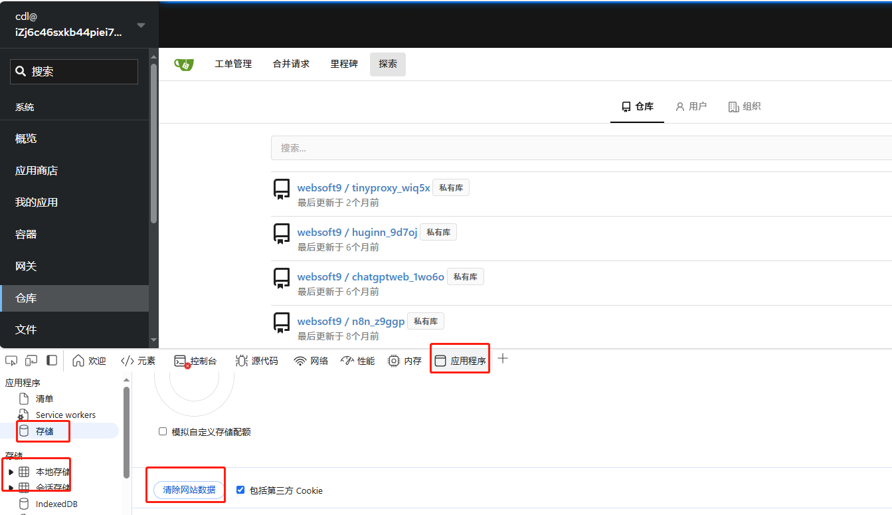

#  Upgrade Websoft9

## Upgrade Websoft9

The **Settings** page of the Websoft9 Console provides an automated online upgrade solution.  

You can also use below upgrade script: 
```
wget -O install.sh https://websoft9.github.io/websoft9/install/install.sh && bash install.sh --execute_mode "upgrade"
```

## Troubleshoot

Below references for your troubleshoot after upgrade Websoft9

### Can not open Git or Gateway interface?

**Description**: Can not access Git or Gateway interface at Websoft9 Console, and have network error
**Reason**: The local browser cache conflict with the Websoft9 server
**Solution**: Clear your browser cache

Blow is the sample for your clear cache for Websoft9 on Microsoft Egde: F12 Shortcut to enter to browser's developer mode 



