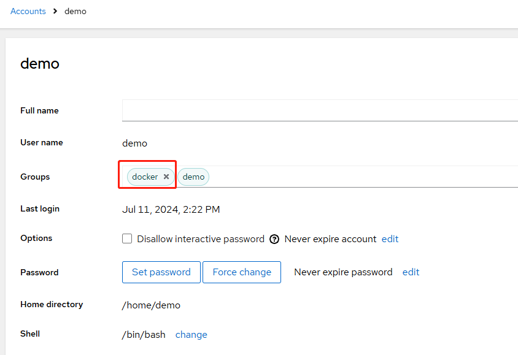

# User credentials

The Websoft9 Console shares the same accounts as the Linux system and uses the PAM (Pluggable Authentication Module) for authentication. So whether you are a root user or a non-root user, you can log in to Websoft9 as long as you provide the password for logging in to Linux.   

Please select one of the user account methods below:  

## Use the existing root account{#convert-root}

The `root` user is already the Websoft9 account with the highest privileges:  

- If `root` account can login Linux by password, it can login **Websoft9 Console** directly
- If `root` account login Linux by key pair, it need to connect Linux and run command `sudo passwd root` to set password

## Use the existing non-root account{#convert-normal}

For non-root account, you will need to follow the steps below to set up before login to Websoft9 Console

- If non-root account use key pair, it need to connect Linux and run command `sudo passwd root` to set password

- Set user group for your non-root account, it need one of **Docker | sudo | root**
    ```
    # Setting Docker permissions (recommended)
    usermod -aG docker yourusername

    # Setting sudo privileges
    usermod -aG sudo yourusername

    # Setting Administrator Privileges
    usermod -aG wheel yourusername
    ```

## Add new account{#add}

### Add user at Websoft9 Console{#add-console}

1. Login to **Websoft9 Console** as `root` user

2. Open the left menu **tool > Accounts** at **Websoft9 Console**

3. Click **Create new account** button to create username and password

4. Set group to **docker** or **root** for this new account by **edit user**
   

### Add user by commands{#add-command}

1. Use `root` user to connect server by SSH

2. Add user by below commands
    ```
    sudo useradd -m -G docker -s /bin/bash <youruser> && echo "<youruser>:<yourpassword>" | sudo chpasswd
    ```


