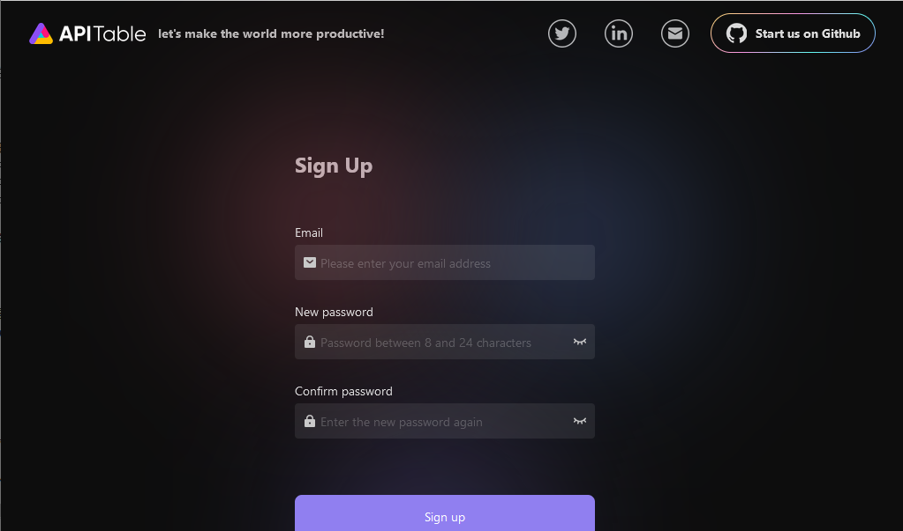
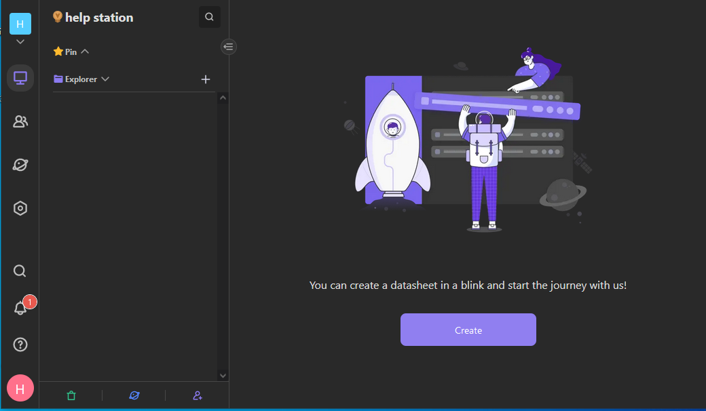

import Meta from './_include/aitable.md';

<Meta name="meta" />

## Getting started{#guide}

### Initial setup{#wizard}

After completing the installation of AITable in the Websoft9 console, get the applicaiton's overview and access information from **My Apps**   

1. Access AITable from your local browser and go to the AITable first registration page
   

2. Register an administrator account to start using it
   

### Use Guide

Refer to the official website documentation: [AITable Introduction](https://help.aitable.ai/docs/guide/tutorial-1-quick-start)

## Enterprise edition 

### Why purchase through Websoft9? 

Websoft9 is a partner of AITable and provides AITable products on major global cloud platforms.  

By purchasing the AITable Enterprise Edition through Websoft9, you get more value: 

- Preferential discounts
- Private deployment services and comprehensive hosting support
- Customized business system development services

### How to purchase   

Contact the [Websoft9 Customer Success Team](./helpdesk)

## Configuration Options{#configs}

- Minimum server configuration: 4 CPUs/8GB RAM
- Multilingual support(✅): **My Settings > Preferences > Language**
- [REST API](https://developers.apitable.com/api/reference/)

## Administer{#administrator}

## Troubleshooting{#troubleshooting}
