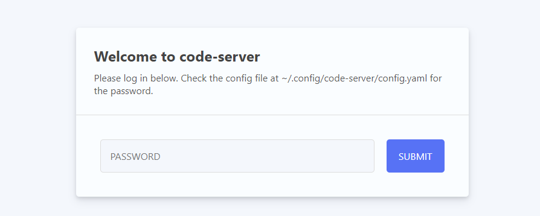
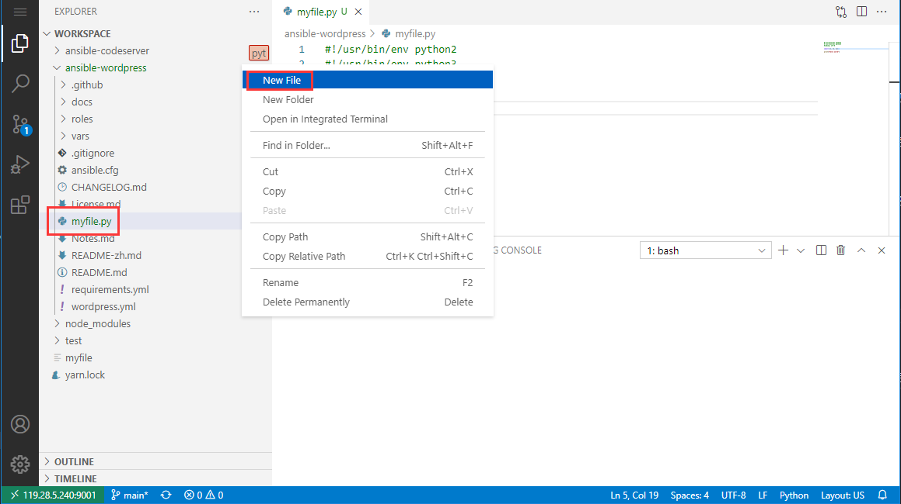

import Meta from './_include/codeserver.md';

<Meta name="meta" />

## Getting started{#guide}

### Verification test{#wizard}

After completing the installation of code-server in the Websoft9 console, get the applicaiton's overview and access credentials from **My Apps**  

1. Use your local browser to access the URL and navigate to the login page.
   

2. Successfully log in to the code-server backend 
   

3. In the code-server backend, select **File > Open Folder > /config/workspace/**.
   

4. In the code-server backend, select **View > Terminal**, and enter the test command in the Terminal area
   

### Installing the environment

Code-server does not come with Python, Node, Java, etc. pre-installed. To install these environments, use `sudo su` in the **Terminal** area to switch to Administrator mode and start the installation.

#### Node.js

```
# install Node,yarn
curl -fsSL https://deb.nodesource.com/setup_20.x | sudo -E bash -
sudo apt-get install -y nodejs
sudo npm install --global yarn

# Delete the running npm run
ps aux
kill -9
```

#### Python

```
# Installation environment
sudo apt update
sudo apt install python3-pip
```

#### Java
```
apt update
apt install openjdk-8-jre
java -version
```
### Program development example

Here is an example of how to use code-server for Python development:

1. Log in to code-server, create a new folder and file named: myfile.py, and copy the following Python example code into the file.
   ```
   /usr/bin/env /usr/bin/env python2
   #! /usr/bin/env python3
   #coding: utf-8

   import os, io, sys

   print("hello world")
   ```
   

2. Run the Python program by executing the command `python myfile.py` in the terminal.
   

3. View the output

### Publishing to the Internet

To publish an application to the Internet using code-server, follow these steps:

1. Assume that the application is running on port 3002 of the container with the following command.
   ```
   npm run start --host 0.0.0.0 --port 3002
   ```

2. Add a Proxy Host to forward to the application port in the container on the Websoft9 console's **Gateway**.

### Multi-developer

Code-server does not support multi-user collaboration natively. For multi-developers, install multiple instances of code-server applications through the Websoft9 console.

## Configuration options{#configs}

- Sudo password in Terminal: same as the code-server console password
- Code compilation build(✅)
- Install extensions(✅)

## Administer{#administrator}

## Troubleshooting{#troubleshooting}

#### Insufficient file permissions?

Description: After switching to the root user and cloning a project, code-server may not have enough permissions to modify or delete project files.
Reason: The default user of the code-server container is `abc`, so it is not possible to modify files with root privileges.
Solution: Use the command `chown -R abc:abc /config/workspace` to fix the problem.

#### Terminal installing components with insufficient permissions?

Switch to root using `sudo su`.

#### Can't copy commands to Terminal?

Ctrl+V

#### Conflict with remote pending pull when git push?

Description: `git push` conflicts with code to be pulled.  
Reason: others have also submitted code  
Solution: Use `git pull --rebase origin main`

#### How do I delete a running process?

Run `ps aux` to see the running processes, then use `kill -9 PID` to terminate the desired process.
