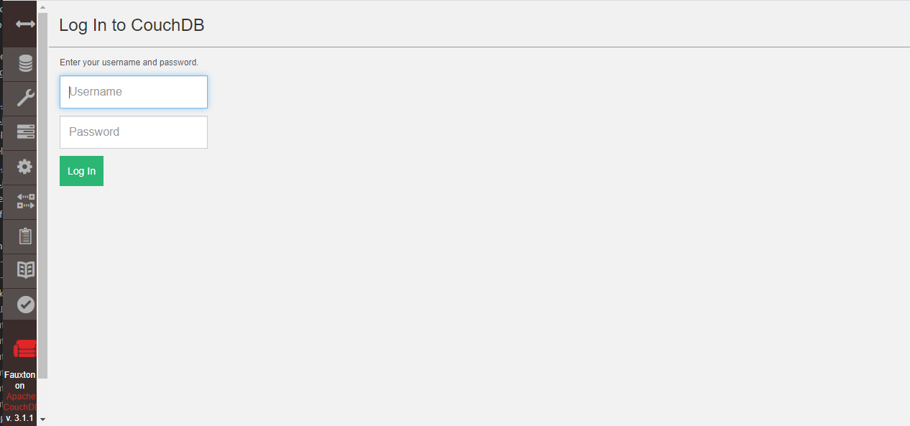

import Meta from './_include/couchdb.md';

<Meta name="meta" />

## Getting started{#guide}

### Login verification{#verification}

1. After completing the installation of CouchDB in the Websoft9 console, get the applicaiton's overview and access credentials from **My Apps**  

2. Navigate to `http://URL/_utils/#login` in your local browser and start logging into the console
   

## Configuration options{#configs}

- Custom configuration file: mount it into the container from the file *src/my.ini* in the repository.
- Command line: CouchDB is API-driven and manipulates data using `curl`.
- [API](https://docs.couchdb.org/en/stable/api/index.html) 
- [Partition](https://docs.couchdb.org/en/stable/partitioned-dbs/index.html#partitioned-databases)
- Maximum number of connections: 2048

## Administer{#administrator}

## Troubleshooting{#troubleshooting}
