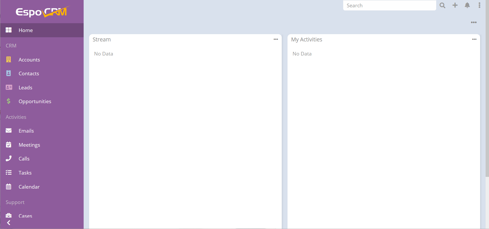

import Meta from './_include/espocrm.md';

<Meta name="meta" />

## Getting started{#guide}

### Login Verification{#verification}

1. After completing the installation of EspoCRM in the Websoft9 console, get the applicaiton's overview and access credentials from **My Apps**  

2. After logging in successfully, access the backend
   
   
## Configuration options{#configs}

- Multilingual(✅): Set the language in the **upper right corner(Menu) > Preferences**   
- Mobile(✅)   
- SMTP(✅): **Backend > Emails > Compose > Group Email Account**  
- Command: [Console commands](https://docs.espocrm.com/administration/commands/)    
- API: [EspoCRM REST API](https://docs.espocrm.com/development/api/)  

## Administer{#administrator}

## Troubleshooting{#troubleshooting}
