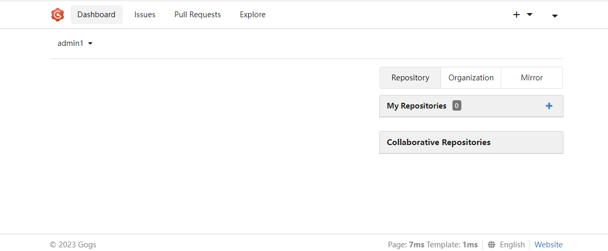

import Meta from './_include/gogs.md';

<Meta name="meta" />

## Getting started{#guide}

### Initial setup{#wizard}

After installing Gogs on the **Websoft9 console**, view the application details through **My Applications** and get the login information from the **Access** tab.  

1. Use your local computer's browser to access the URL and navigate to the initialization page.   

2. Database settings: Choose SQLite, if you choose any other database, you will need to prepare available databases in advance.

3. Application basic settings: Follow the instructions carefully to avoid errors when filling out the fields.

   - Domain name: Use the URL from the current browser access (which may include the port). Remove the `http://` prefix, keep the remaining part.
   - Application URL: Use the URL currently accessed by your browser.
   - SSH port: Enter the port number of the server that was set when Gogs was installed.
   - HTTP port: Do not modify this field.

4. Set the admin account and email address (Note: "admin" is not allowed as a username).

5. After successful installation, assess the system backend

    

## Configuration options{#configs}

- CLI: `./gogs -h`
- [Webhook](https://gogs.io/docs/features/webhook)
- Multilingual (✅): Gogs automatically adapts to the browser language, which can also be selected from the bottom menu

## Administer{#administrator}

## Troubleshooting{#troubleshooting}

