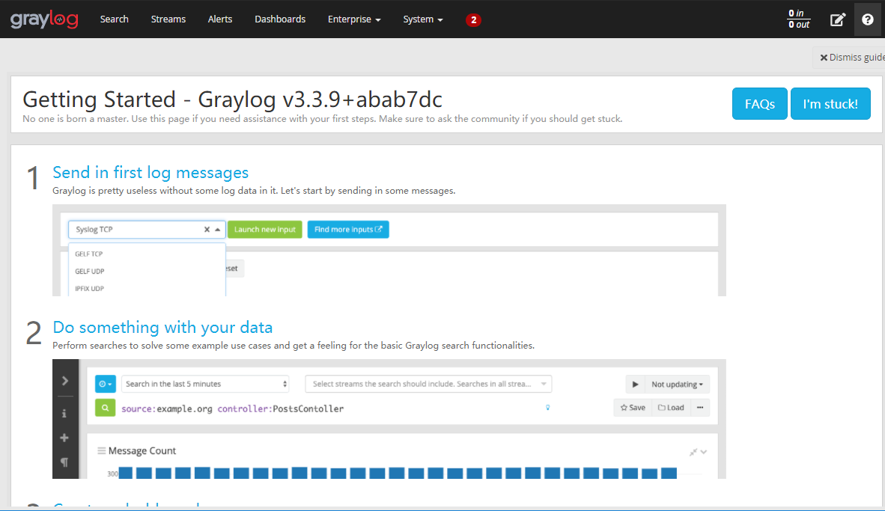
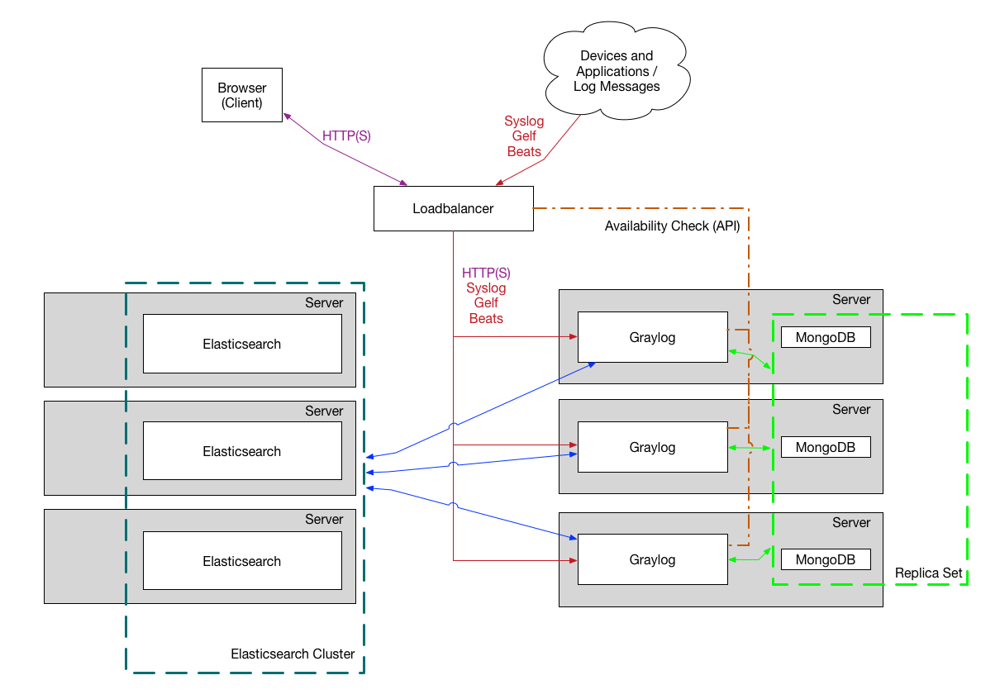
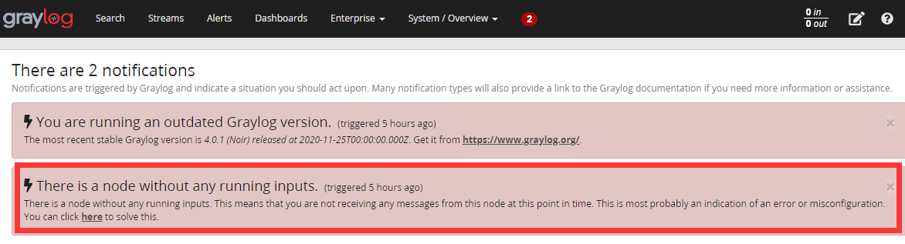
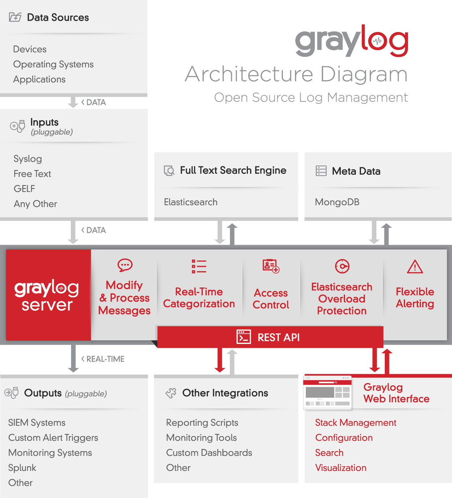

import Meta from './_include/graylog.md';

<Meta name="meta" />

## Getting started{#guide}

### Initial setup{#wizard}

1. After installing Graylog in the **Websoft9 console**, view the application details through **My Applications** 

   - Get the **Access URL** and **Login User and Password** in the **Access** tab
   - Get the **Main Container Name** in the **Container** tab

2. View the logs of the **Main Container** to get the user and initial password

3. Enter **Access URL** in your browser, and enter the user and initial password obtained in step2 to enter the initial page.

4. Click **Create CA** and follow the prompts to complete the initialization

5. After the initialization is complete, enter the login page and input the **Login User and Password** obtained in step1

6. Successfully log in to the Graylog backend interface
  

## Enterprise Edition

Websoft9 is a Graylog Enterprise Edition partner. Pricing factors for Graylog Enterprise Edition include:  

* Log Storage: Graylog Enterprise Edition pricing is primarily based on log storage.
* Clustering: The deployment of Graylog cluster also affects pricing.
* ES: Elasticsearch offers open-source clustering, but advanced features require a commercial license. 

## Configuration options{#configs}

- SMTP (✅): Edit the **transport_email** parameters in the configuration file
- Configuration file: To configure environment variables for containers, prefix all configuration variables with uppercase GRAYLOG_ 
    ```
    GRAYLOG_TRANSPORT_EMAIL_ENABLED: "true"
    GRAYLOG_TRANSPORT_EMAIL_HOSTNAME: smtp
    GRAYLOG_TRANSPORT_EMAIL_PORT: 25
    GRAYLOG_TRANSPORT_EMAIL_USE_AUTH: "false"
    GRAYLOG_TRANSPORT_EMAIL_USE_TLS: "false"
    GRAYLOG_TRANSPORT_EMAIL_USE_SSL: "false"
    ```
- [Graylog API](https://docs.graylog.org/v1/docs/rest-api)

## Administer{#administrator}

- Clustering: Graylog supports complex [clustered](https://docs.graylog.org/v1/docs/multinode-setup) deployments.
  

## Troubleshooting{#troubleshooting}

#### Alerts and Errors after login ?

Description: A prompt indicating "There is a node without any running inputs." What does this mean?
  
Reason: This is just a reminder that there is currently no inputs, not an error.  
Solution: Create a new local input to resolve this reminder.  

Description: Index rotation strategy null not found...?   
Reason: This issue occurs when the free disk space is less than 15%.  
Solution: Free up redundant files or increase server disk space.  

#### Does Graylog store data?

Graylog does not store data, it relies on Elasticsearch to store data.

Elasticsearch architecture:

* Elasticsearch is used to store and search logs, with clustering improving efficiency
* Graylog is used to transfer and present data, with clustering improving availability
* MongoDB is used to store configuration information, which is minimal, and clustering is limited.

#### What is the Architecture of Graylog?

Please read the official [Architecture Guide](https://www.slideshare.net/Graylog/graylog-engineering-design-your-architecture)



