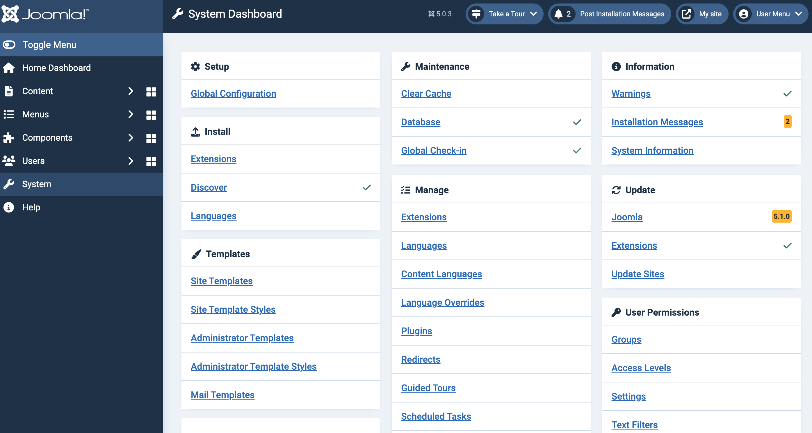

import Meta from './_include/joomla.md';

<Meta name="meta" />

## Getting started{#guide}

### Login Verification{#verification}

1. After completing the installation of Joomla in the Websoft9 console, get the applicaiton's overview and access credentials from **My Apps**  

2. Log in to the Joomla backend  

   

### Install template{#template}

Joomla template installation is primarily done by uploading template installation packages:

1. Prepare the template installation package(a .zip file), as the Joomla kernel cannot be included in the template package

2. In the Joomla backend, navigate to **System > Install > extensions** to access the extension management interface

3. Choose the upload package file method for installation

4.  Manage templates by going to **System > Templates**.

## Configuration options{#configs}

- [Joomla Extensions](https://extensions.joomla.org/): In the Joomla backend, go to **System > Install > Extensions** to access the extension management page and install extensions from the Web

- SMTP(✅): In the backend, navigate to **System > Global Configuration > Server > Mail > Mailer** and select `SMTP` for the server email type

- Multilingual(✅)
  - Install languages in the backend by going to **System > Install > Languages**.
  - Select your language in the Joomla backend under **Edit Profile > Basic Settings** for both frontend and backend.

- Cache: Clear the cache in the backend by going to **System > Maintenance > Clear Cache**

- Configuration file: */path/configuration.php*

- [Joomla API](https://api.joomla.org/)

- Backend address: `http://URL/administrator`

- Online upgrade(✅)

## Administer{#administrator}

- Online backup: Use the Joomla extension [Akeeda Backup](https://www.akeebabackup.com/download.html) for online backup and recovery

## Troubleshooting{#troubleshooting}
