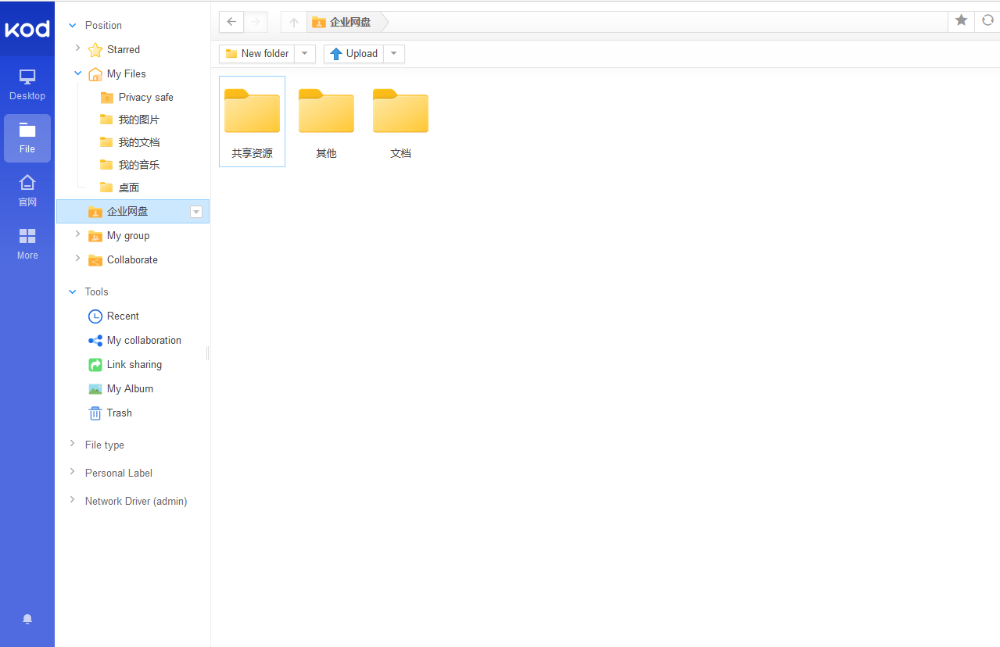

import Meta from './_include/kodbox.md';

<Meta name="meta" />

## Getting started{#guide}

### Login Verification{#verification}

1. After completing the installation of KodBox in the Websoft9 console, get the applicaiton's overview and access credentials from **My Apps**  
    
2. Access the KodBox URL. The first step is to create an administrator account, then log in to the KodBox console
    
    
## Enterprise Edition  

The Community Edition of kodbox is licensed under GPLv3, supporting up to 10 users and 1 department.  

As Websoft9 is a partner of KodBox's Enterprise Edition, purchasing through Websoft9 offers additional benefits:  

- More favorable discounts 
- Enhanced technical services, including integration with cloud storage systems, and more 
- More comprehensive solutions

## Configuration options{#configs}

- Multilingual(✅)
- Plugin(✅)

## Administer{#administrator}

## Troubleshooting{#troubleshooting}
