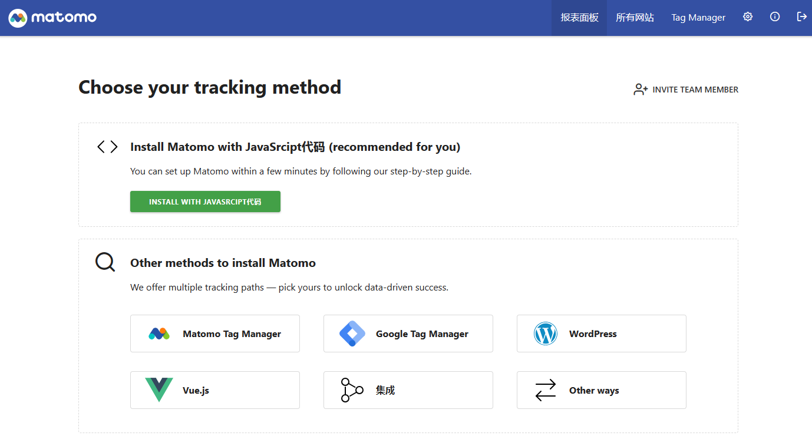

import Meta from './_include/matomo.md';

<Meta name="meta" />

## Getting started{#guide}

### Initial setup{#wizard}

1. After installing Matomo via the **Websoft9 console**, view the application details through **My Applications** and get the login information from **Access**.  

2. Access the URL using a local computer browser and procceed through the initialization wizard. 

3. Follow the wizard to complete the setup by: configuring the database connection (default values are recommended), creating an administrative account, and adding your first monitored site.
  
4. Log in to the backend and get the JS script of the monitored website.
  

## Configuration options{#configs}

- Multilingual (✅)
- [Matomo API](https://matomo.org/guide/apis/)
- Monitor Multi-Site (✅)

## Administer{#administrator}

## Troubleshooting{#troubleshooting}

