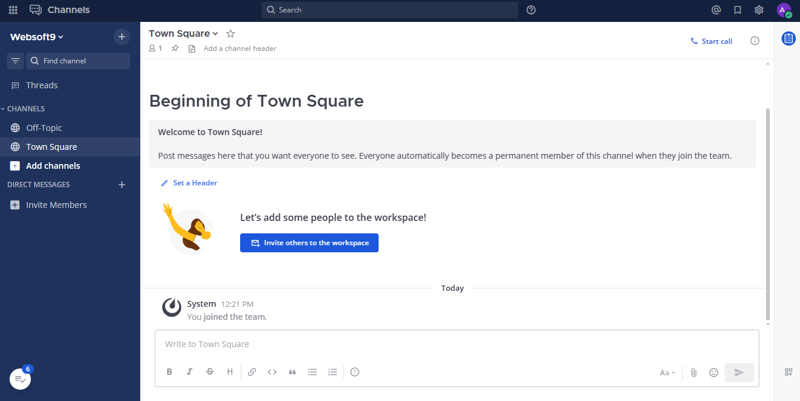

import Meta from './_include/mattermost.md';

<Meta name="meta" />

## Getting started{#guide}

### Initial setup{#wizard}

1. After installing Mattermost via the **Websoft9 console**, view the application details through **My Applications** and get the login information from **Access**.  

2. Access the URL using a local computer browser and complete the initialization wizard. 

3. Follow the wizard's steps to create an admin account, set up a team, and configure other settings.

4. Log in to the backend to get started. 
   

## Configuration options{#configs}

- Configuration file: /path/mattermost_config/config.json
- Mobile (✅): [download address](https://mattermost.com/download/#mattermostApps)
- Multilingual (✅): select  **Administration > Personal >  Settings > langugue**
- SMTP (✅): select **Administration > System > General Settings > Email server settings** 
- Server-side command line: [mattermost](https://docs.mattermost.com/administration/command-line-tools.html)
- CLI: [mmctl](https://docs.mattermost.com/administration/mmctl-cli-tool.html)
  ```
  /opt/mattermost/bin/mattermost -h
  /opt/mattermost/bin/mmctl -h
  ```
- [Mattermost API Reference](https://api.mattermost.com/)
- Setting the maximum number of users per team: **SITE CONFIGURATION > Users and Teams > Max Users Per Team**

## Administer{#administrator}

- Additional action for URL change: After changing the domain name through the Websoft9 console, also update the **Site URL** in the Mattermost backend: **ENVIRONMENT > Web Server**.

## Troubleshooting{#troubleshooting}

#### Mattermost vs Slack？

[Mattermost vs Slack](https://mattermost.com/mattermost-vs-slack/)
