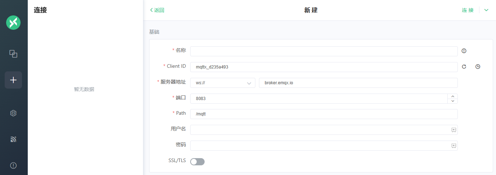

import Meta from './_include/mqttx.md';

<Meta name="meta" />

## Getting started{#guide}

### Login Verification{#verification}

1. Complete the installation of MQTTX via the Websoft9 console,  and get the applicaiton's overview and access information from "My Apps"  

2. Create a connection in the MQTTX console

   - The client ID is automatically generated 
   - Server address: Use the protocol, address, and port values from the connected service.

   

### Integrate RabbitMQ 

1. Prepare RabbitMQ 

   1. Install RabbitMQ from the Websoft9 App Store 
   2. Enable the RabbitMQ plugins using the following commands: 
      ``` 
      rabbitmq-plugins enable rabbitmq_mqtt 
      rabbitmq-plugins enable rabbitmq_web_mqtt  
      ``` 
2. Create a new RabbiMQ connection in MQTTX to verify the accuracy of the host, port, account, and connection protocol.

### Integrate EMQX 

1. Prepare EMQX 

   1. Install EMQX from the Websoft9 App Store 
   2. Open the EMQX Dashboard, navigate to "Problem Analysis">"WebSocket Client", and configure the **username, password, and protocol version**  for the default WebSocket connection

2. Create a new EMQX connection in MQTTX to verify the accuracy of the host, port, account, and connection protocol.

## Configuration options{#configs}

- Multilingual (√)

## Administer{#administrator}

## Troubleshooting{#troubleshooting}
