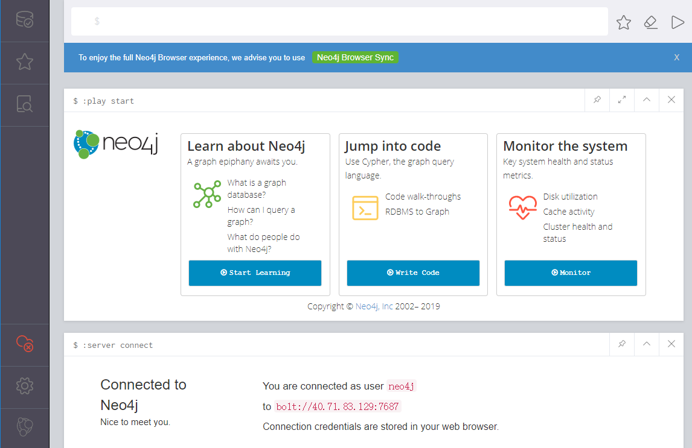

import Meta from './\_include/neo4j.md';

<Meta name="meta" />

## Getting Started {#guide}

### Initial Setup {#wizard}

1. After completing the installation of Neo4j via the Websoft9 console, retrieve the application's overview and access information from **My Apps**.

2. Access the Neo4j Browser and fill in the accurate Connection URL, account, and password to successfully log in.
   

3. From the **Neo4j Browser Sync**, click on **Clear local data** to log out.

### Command Cypher Shell

1. Access the command mode of the Neo4j container and use the 'cypher shell' command:

   ```
   Cypher shell
   username: neo4j
   password: *****
   Connected to Neo4j 4.1.0 at neo4j://localhost:7687 as user neo4j.
   Type :help for a list of available commands or :exit to exit the shell.
   Note that Cypher queries must end with a semicolon.
   neo4j@neo4j >
   ```

2. Enter the command `CALL dbms.showCurrentUser()` to view the current user:

   ```
   neo4j@neo4j >CALL dbms.showCurrentUser();
   +--------------------------+
   |Username | roles | flags|
   +--------------------------+
   |Neo4j | admin | []|
   +--------------------------+
   1 row available after 22 ms, consumed after another 1 ms
   ```

3. User management commands (Enterprise Edition only):

   ```
   #Show all users
   SHOW USERS;
   CALL dbms.security.listUsers();

   #Create a new user, the third parameter represents requestchangepassword
   CALL dbms.security.createUser ('username','password', false);

   #Delete user
   CALL dbms.security.deleteUser ('username');
   ```

4. Change password:
   ```
   cypher-shell -u neo4j  -p neo4j  -d system
   ALTER CURRENT USER SET PASSWORD FROM 'neo4j' TO 'neo4j123';
   ```

## Enterprise Edition

### Hosting Services

Websoft9 can provide comprehensive procurement and hosting support services for Neo4j Enterprise Edition.

### Application Scenarios

- **Social Field**: Platforms like Facebook and LinkedIn analyze user friend information to manage relationships and recommend connections.
- **Retail Field**: Creating relationship models between retailers and platforms, as described in [Beer and Diapers](https://book.douban.com/subject/3283973/).
- **Financial Field**: Building network profiles by analyzing social relationships, aiding in risk control.
- **Automotive Manufacturing Field**: Managing complex supplier relationships, reducing supply chain risks.
- **Telecommunications Field**: Managing complex network infrastructure topologies for improved operation and maintenance.
- **Knowledge Graphs Field**: Creating relationship graphs between companies and individuals, such as Qichacha and Tianyancha.
- **Public Field**: Analyzing the travel paths of COVID-19 patients to improve contact tracing.

Graph databases store relationships between people, objects, and their interactions, used for purposes like recommendations, knowledge graphs, and efficiency improvement.

## Configuration Options {#configs}

- Multi-user: [User and Role Management](https://neo4j.com/docs/cypher-manual/current/administration/security/users-and-roles/), supported in the Enterprise Edition only.

- Enable remote access: Add configuration section `dbms.default_listen_address=0.0.0.0`.

- [Configuration file](https://neo4j.com/docs/operations-manual/current/configuration) (Mounted): `/var/lib/neo4j/neo4j.cn`.

- Port Description: [Port Configuration](https://neo4j.com/docs/operations-manual/current/configuration/ports/).

- Tools: [Neo4j Tools](https://neo4j.com/docs/operations-manual/current/tools/).

- Command line: [Cypher Shell](https://neo4j.com/docs/operations-manual/current/tools/cypher-shell/).

- [Neo4j REST API](https://neo4j.com/docs/rest-docs/current/).

- [Neo4j Admin](https://neo4j.com/docs/operations-manual/current/tools/neo4j-admin/).

- [Clustering](https://neo4j.com/docs/operations-manual/current/clustering/): Enterprise Edition feature.

- [Authentication and Authorization](https://neo4j.com/docs/operations-manual/current/authentication-authorization/).

## Administration {#administrator}

- **[Retrieve Password](https://neo4j.com/docs/operations-manual/current/configuration/password-and-user-recovery)**: Add `dbms.security.auth_enabled=false` to the configuration file, disable password verification, and reset the password before restoring.

## Troubleshooting {#troubleshooting}

#### Error Connecting to Database?

Problem description: Neo4j Browser encountered an error when connecting to the database.
Cause: The **security group port** corresponding to your server is not enabled (entry rule), preventing the connection.

#### Is Role Displayed as Empty?

Neo4j Community Edition does not support roles, so they are displayed as empty.
