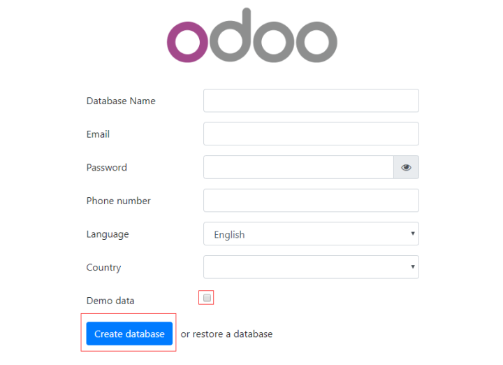
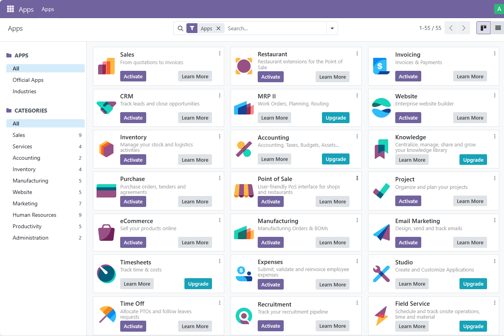

import Meta from './\_include/odoo.md';

<Meta name="meta" />

## Getting Started {#guide}

### Initial Setup {#wizard}

1. After completing the installation of Odoo via the **Websoft9 Console**, retrieve the application's **Overview** and **Access** information from **My Apps**.

2. Access the URL using a local browser to start the initialization: create the database.
   

3. Fill in all the parameters (Email and Password are login credentials), select **Create database**, and wait for the initialization to complete.

4. Log in to the backend. By default, you will enter the Apps page.  
   

5. Select the **Settings** icon on the upper left corner to open the **Settings** menu. Here, you can set the language, enterprise information, etc.

### Developer Mode {#dev-mode}

How to enable developer mode: Select **Settings > Developer Tools > Activate the developer mode**.

### Active your extra addons

1. Login to Odoo console, and enable developer mode
2. Upload your code to container path `/mnt/extra-addons`(You can mount this directory to host machine by yourself)
3. Then restart Odoo container and you can see your extra Apps

### Export PDF

Install Invoice, Purchase, and other modules to test the **Print to PDF** function.

## Enterprise Edition

To use the Enterprise Edition, contact the [Websoft9 Customer Success Team](./helpdesk#contact) for the image and trial license.

- A trial license is required after the first application is installed in the Enterprise Edition.
- After 1 month, the trial will expire, and the database will be emptied.

Websoft9 provides procurement, delivery, and full hosting of Odoo Enterprise Edition:

- Efficient business processes
- Fully managed services for both public and private clouds
- Low-code development of Odoo for in-house management

## Configuration Options {#configs}

- [Odoo Apps Marketplace](https://www.odoo.com/apps/modules) (✅)

- Customize Logo (✅): Select **Settings > Users & Companies > Companies > My Company > Your Logo**.

- Multi-tenant (multi-business organization) (✅): Use **Manage Databases** in the Odoo login interface to enter database management, where you can add databases, i.e., businesses. Multiple databases can share the Odoo runtime.

- Multilingual (✅): Select **Preferences** in the settings menu at the top-right corner to set the language.

- Odoo Configuration file (mounted): `/etc/odoo/odoo_config/odoo.conf`.

- CLI: `odoo -h`.

- [API](https://www.odoo.com/documentation/17.0/developer/misc/api/odoo.html).

- Community Edition Online Upgrade to Enterprise Edition (✅).

- SMTP (✅): Select **Settings > General Settings > Discuss > Use Custom Email Servers**. If you cannot find the **Discuss** option, first select the Mail Plugin in Integrations.

## Administration {#administrator}

- **Database Management**: Odoo comes with a database manager, accessed via the **Manage Database** link on the Odoo login page. It supports operations such as create, copy, backup, restore, and delete.

## Troubleshooting {#troubleshooting}

#### Delete Demo Data?

There is no easy tool to delete demo data.

#### 413 Request Entity Too Large?

You need to configure `client_max_body_size 0` in the Websoft9 gateway to lift the file size limit.
