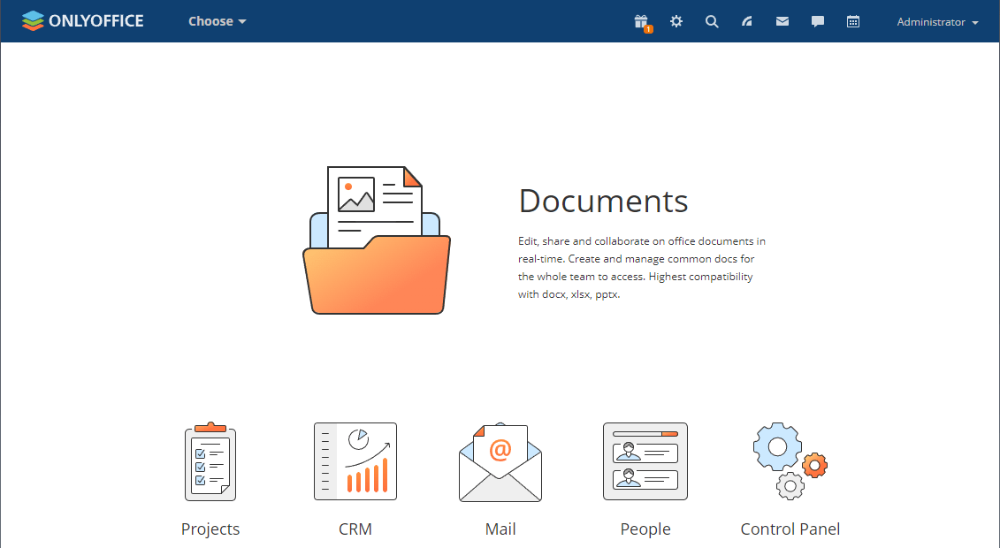
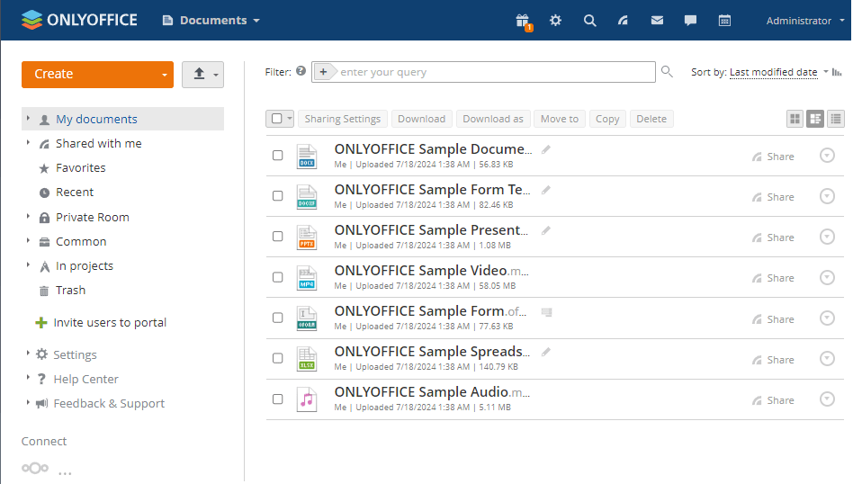
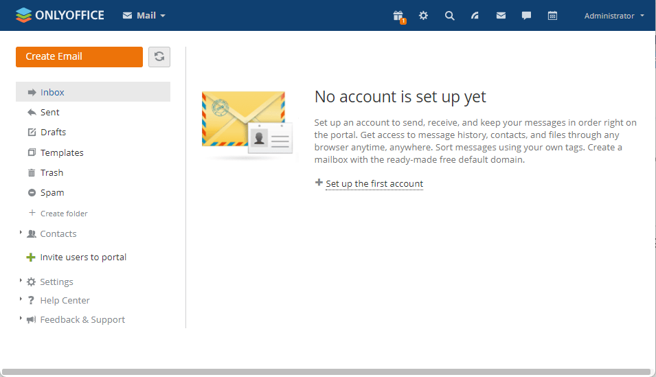

import Meta from './\_include/onlyoffice.md';

<Meta name="meta" />

## Getting Started {#guide}

### Initial Setup {#wizard}

1. After completing the installation of ONLYOFFICE Workspace via the **Websoft9 Console**, retrieve the application's **Overview** and **Access** information from **My Apps**.

2. Access the URL using a local browser, enter the initialization page, and wait for 2-5 minutes until the account setup screen appears.
   

3. Set your password and email address (login name), log in, and start using ONLYOFFICE Workspace.
   

### Demonstration of Features

- **Document Management (with online editing)**
  

- **Project Management**
  

- **Customer Relationship Management (CRM)**
  

- **Mail Management Portal**
  

- **Third-Party Integration**
  

## Configuration Options {#configs}

- Change Password: Select **Administrator > Personal Information > Log out from all active connections**.

- Multilingual (✅)
- Mail Server (Optional)
- [Compare Community Edition and Enterprise Edition](https://github.com/ONLYOFFICE/CommunityServer#compare-community-edition-and-enterprise-edition)

## Administration {#administrator}

## Troubleshooting {#troubleshooting}
