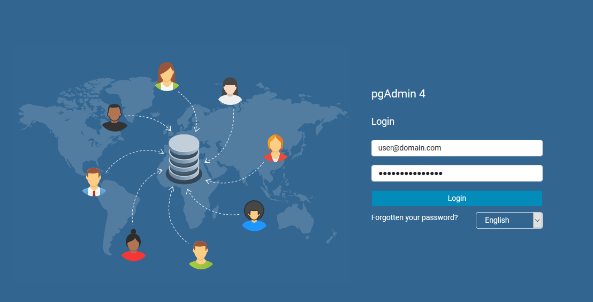
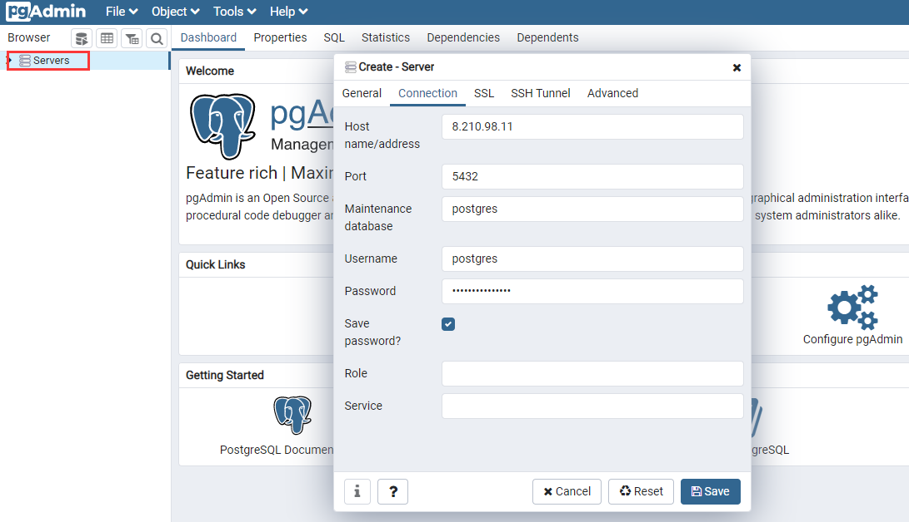

import Meta from './\_include/pgadmin.md';

<Meta name="meta" />

## Getting Started {#guide}

### Initial Setup {#wizard}

Before using pgAdmin, if you do not have PostgreSQL, you can install it through the **App Store** in the Websoft9 console.

### Login to pgAdmin to Connect to the Database

After installing pgAdmin via the **Websoft9 Console**, retrieve the application's **Overview** and **Access** information from **My Apps**.

1. Open the login page in your local computer browser and enter pgAdmin.
   

2. After logging in successfully, you will enter the console.
   

3. Connect to a PostgreSQL database.
   

### Database Management

- **Servers > Create > Database**: Create a new database.
- **Servers > Create > Login/Group Role**: Create a PostgreSQL user.

## Configuration Options {#configs}

- pgAdmin Client: [Windows Download](https://www.pgadmin.org/download/)
- Backup (✅)

## Administration {#administrator}

## Troubleshooting {#troubleshooting}
