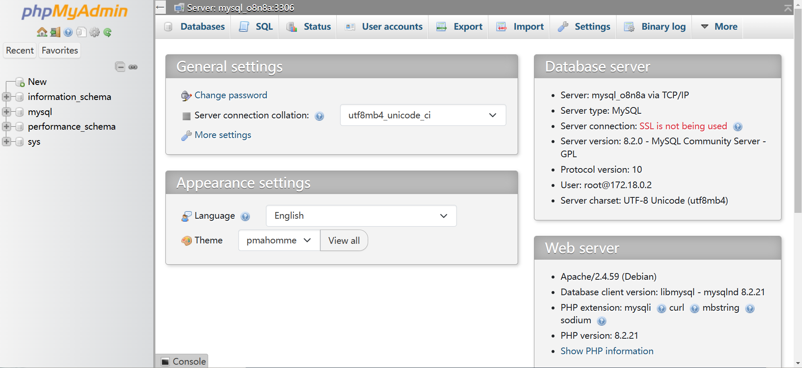

import Meta from './\_include/phpmyadmin.md';

<Meta name="meta" />

## Getting Started {#guide}

### Initial Setup {#wizard}

1. Once phpMyAdmin is installed via the **Websoft9 Console**, retrieve the application's **Overview** and **Access** information from **My Apps**.

2. Access the login screen of phpMyAdmin and enter the connection information for MySQL/MariaDB:

   - **Server**: MySQL host name, supports both intranet and extranet connections.

     - Intranet connection: Intranet IP/container name/service name.
     - Extranet connection: Host URL provided by the cloud database vendor.

   - **Account**: root

   - **Password**: Database password

     

3. After logging in, you can easily manage the database and run SQL queries.

   

### Manage Database

- Change Password: **phpMyAdmin Home > General settings > Change password**
- New Database: **phpMyAdmin left menu > New**
- New User: **phpMyAdmin Top Menu > User accounts**
- Backup and Restore: **phpMyAdmin top menu > Import or Export**
- Enable Remote Access: **phpMyAdmin Top Menu > User accounts**, edit the user's **Login Information**, and in the Host name option, select **Any host**, then click **Go** to apply.

## Configuration Options {#configs}

- Multilingual (✅)
- Configuration file: `/etc/phpmyadmin/config.user.inc.ph`

## Administration {#administrator}

- By default, phpMyAdmin restricts the import file size. You can change this limit by modifying the `UPLOAD_LIMIT=20M` in the .env file.

## Troubleshooting {#troubleshooting}
