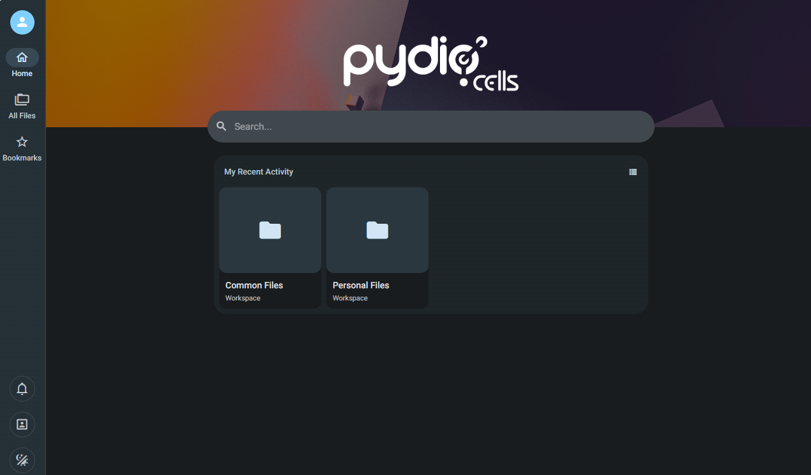
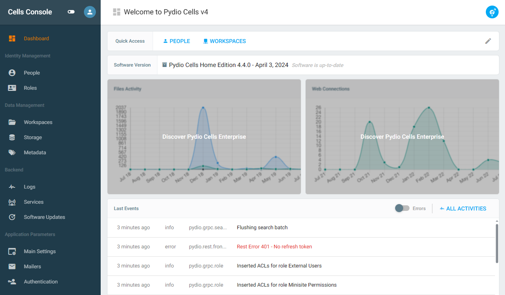

import Meta from './\_include/pydio.md';

<Meta name="meta" />

## Getting Started {#guide}

### Initial Setup {#wizard}

1. After completing the installation of Pydio in the **Websoft9 Console**, retrieve the application's **Overview** and **Access** information from **My Apps**.

2. Once logged in, the user interface will be displayed by default.
   

3. To access the administrator settings interface, click on **Admin > Cells Console** in the upper right corner.
   

### External Storage

You can access the storage management interface through **Pydio Console > Cells Console > Storage**. Click **+Datasource** to add a new data source.

### Document Editing and Previewing {#docs}

Pydio provides middleware support for [Collabora Online](./collabora) and [ONLYOFFICE](./onlyofficedocs) (Enterprise Edition only):

1. Optional: Install [Collabora Online](./collabora) from the Websoft9 App Store.
2. Enable the Collabora Online plugin in the Cells Console.
3. Set up the connection to Collabora Online.

## Configuration Options {#configs}

- Plugin Market (✅): **Application Parameters > All Plugins**, with more plugins available for the Enterprise Edition.
- Compatible External Storage: S3, Minio.
- [Cells Client](https://pydio.com/en/docs/developer-guide/cells-client)
- [API Documentation](https://pydio.com/en/docs/developer-guide)
- [Mobile App](https://pydio.com/en/download)
- Configuration File: It is recommended to personalize the configuration through the container environment variables.

## Administration {#administrator}

## Troubleshooting {#troubleshooting}

### Can't Find Application Parameters?

There is a switch for **Application Parameters** in the left-hand menu of the Cells Console.
