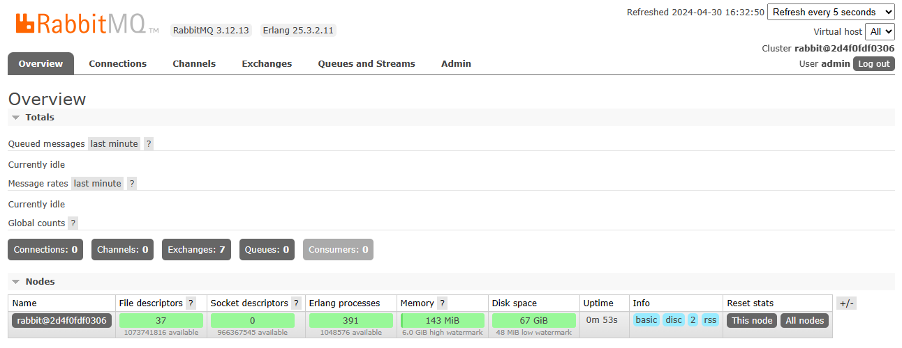

import Meta from './\_include/rabbitmq.md';

<Meta name="meta" />

## Getting Started {#guide}

### Initial Setup {#wizard}

1. After completing the installation of RabbitMQ in the **Websoft9 Console**, retrieve the application's **Overview** and **Access** information from **My Apps**.

2. Once you successfully log in, you will be directed to the RabbitMQ console interface.
   

### Remote Connections

RabbitMQ has remote connectivity enabled by default. However, when accessing the RabbitMQ service through a local client (e.g., [QueueExplorer](https://www.cogin.com/mq/index.php)), ensure the following:

- The port for remote access is open.
- The login account is set with appropriate **Tags** (equivalent to assigning roles).

### Creating Users

The RabbitMQ console allows user creation. When creating a user, ensure that you assign appropriate **Tags** for the user.

### Configuring TLS/SSL in the Container

To configure TLS/SSL for RabbitMQ, follow these steps:

1. Download the required certificate to the `/etc/rabbitmq/ssl` directory inside the RabbitMQ container.

2. Modify the configuration file `/etc/rabbitmq/rabbitmq.config` as shown below:

   ```
   ssl_options.cacertfile = /etc/rabbitmq/ssl/ca_certificate.pem
   ssl_options.certfile   = /etc/rabbitmq/ssl/server_certificate.pem
   ssl_options.keyfile    = /etc/rabbitmq/ssl/server_key.pem
   ssl_options.verify     = verify_peer
   ssl_options.fail_if_no_peer_cert = false
   ```

3. Restart the RabbitMQ application for the changes to take effect.

## Configuration Options {#configs}

- Configuration file directory (mounted): `/etc/rabbitmq/conf.d`
- Multi-user Support (✅): Users can be added via the console.
- Container ports:
  - 15672: RabbitMQ console
  - 5672: AMQP port
  - 4369: Erlang port
- Command-Line Tool (CML): `rabbitmqctl`
- [API Documentation](https://www.rabbitmq.com/dotnet-api-guide.html)

## Administration {#administrator}

- **Upgrading**: For upgrade instructions, refer to [Upgrading RabbitMQ](https://www.rabbitmq.com/upgrade.html).
- **Resetting Password**: In the RabbitMQ container, run the following command to reset the password:
  ```
  rabbitmqctl change_password admin newpassword
  ```

## Troubleshooting {#troubleshooting}
