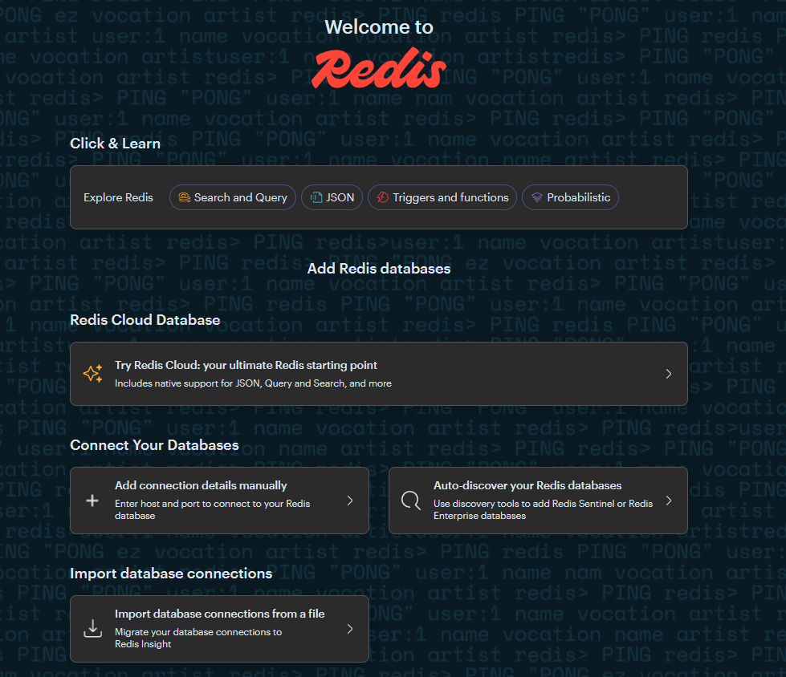

import Meta from './\_include/redisinsight.md';

<Meta name="meta" />

## Getting Started {#guide}

### Initial Setup {#wizard}

After installing Redash in the Websoft9 console, you can view the application details through **My Applications** and find the URL in the **Access** tab.

### Connecting to a Redis Database {#wizard}

1. Prepare the Redis database (you can install [Redis](./redis) from the Websoft9 App Store).

2. Open the RedisInsight interface, accept the license agreement, and begin using it.
   

3. Click **Add Database Manually** to connect to the Redis database.

   - **Host**:

     - Intranet: Use the IP, container name, or service name.
     - Extranet: Obtain the URL from your service provider.

   - **Port**: 6379

   - **Name**: redis

   - **Username**: Leave empty.

   - **Password**: Enter the Redis database password.

## Configuration Options {#configs}

- Connect to Multiple Databases: Supported (✅)
- Console Authentication: RedisInsight Console does not require account authentication.

## Administration {#administrator}
