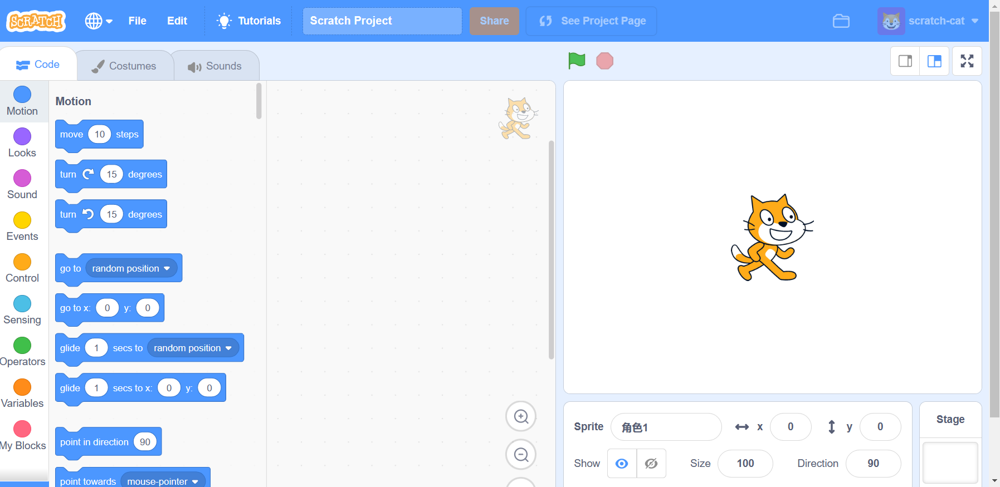

import Meta from './\_include/scratch.md';

<Meta name="meta" />

## Getting Started {#guide}

### Initial Setup {#wizard}

1. After completing the installation of Scratch in the **Websoft9 Console**, retrieve the application's **Overview** and **Access** information from **My Apps**.

2. Direct browser access takes you to Scratch.
   

3. The first time Scratch loads, it requires more than 20MB of data. If your network bandwidth is inadequate, the loading process will be extremely slow. Please wait patiently!

## Configuration Options {#configs}

- Multilingual (✅): Switchable
- Backend Login (❌)

## Administration {#administrator}

## Troubleshooting {#troubleshooting}

#### Not loading or very slow to access? {#slowy}

The first time Scratch loads, it requires over 20MB of data. For example, if you are using 2Mbps bandwidth, the estimated loading time would be:
20000kB / (128kB/s x 2) ≈ 78 seconds. If the bandwidth is insufficient, it will be very slow.

Additionally, Scratch loads Google Stats resources, which may lead to anomalous or slower access.

#### Background and character icons not loading? {#assets}

Reason: Scratch's pre-made character icons and background images are stored on the official server, and there may be network limitations when retrieving them.

Solution: [Download](https://libs.websoft9.com/apps/scratch/asset.zip) the assets to your local computer and use them by **uploading**.
