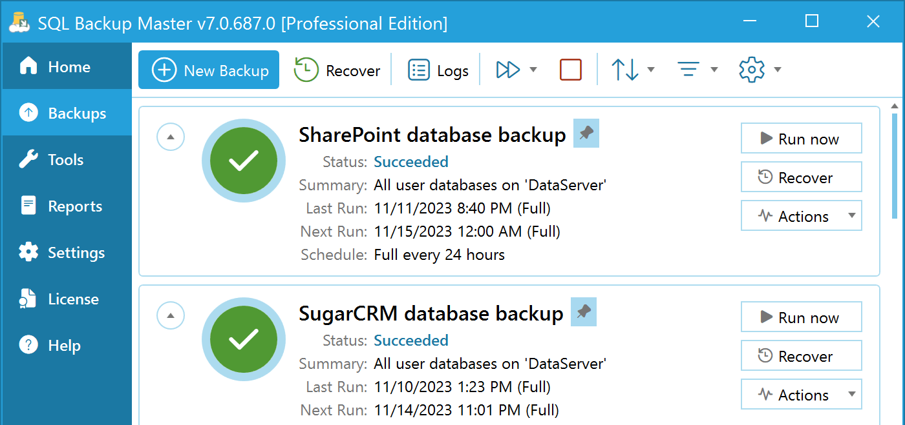

import Meta from './\_include/sqlserver.md';

<Meta name="meta" />

### Intellectual Property Statement {#license}

The SQLServer covered in this document are all Express editions and may be used or distributed free of charge [(detailed terms)](https://www.microsoft.com/zh-cn/download/details.aspx?id=29693).

- Linux Server for: SQL Server Express 2017, 2019, 2022

## Getting Started {#guide}

### Initial Setup {#wizard}

1. After completing the installation of SQLServer in the **Websoft9 Console**, retrieve the application's **Overview** and **Access** information from **My Apps**.

2. Complete the installation wizard step by step.

### Client Remote Connection

SQL Server installed on Linux can be connected remotely through a client tool if the server allows it:

1. Install the common database management tool [CloudBeaver](./cloudbeaver).

2. Log in to CloudBeaver and create a new SQL Server connection.

You can also install tools such as Navicat on your local computer to manage the database.

## Configuration Options {#configs}

- Path on Linux:

  - Data directory (mounted): `/var/opt/mssql`

- Command line: [mssql-cli](https://docs.microsoft.com/en-us/sql/tools/mssql-cli)

- To change the database path: Under SQL Server Enterprise Manager **Properties**, open the **Database Settings** tab under **Database Default Location**.

- [Express upgrades to other versions of SQL Server](https://docs.microsoft.com/zh-cn/sql/database-engine/install-windows/upgrade-to-a-different-edition-of-sql-server-setup?view=sql-server-ver15).

## Administration {#administrator}

### Manual Backup {#backup}

The generic manual backup procedure is as follows:

1. SQL Server Enterprise Manager: Right-click the target database and select **Tasks > Backup** to open the Backup Database window.

2. Follow the backup wizard step by step to complete the backup.

### Auto Backup {#autobackup}

SQL Server Express does not have a SQL Server Agent service, so you cannot directly use the automatic backup feature built into SQL Server.

However, alternative autobackup solutions are widely used:

- Use [SQL Backup Master](https://www.sqlbackupmaster.com/), a professional free backup tool (recommended).
  

- Write a backup script and run it as a scheduled task on your Windows system.

## Troubleshooting {#troubleshooting}

#### Can't log in with SQL Server password?

Reference: Enable password authentication.

#### SQL Server local connection failed?

Check if the server name is correct: In **Server Name**, select **Browse More...** and choose the correct server.

#### Backup failed: ensure correct media...?

Reason: This is not a failure of the database itself but an issue with the usage of the backup media.

Solution: Remove the old backup file and overwrite it with a new one during the backup process.
