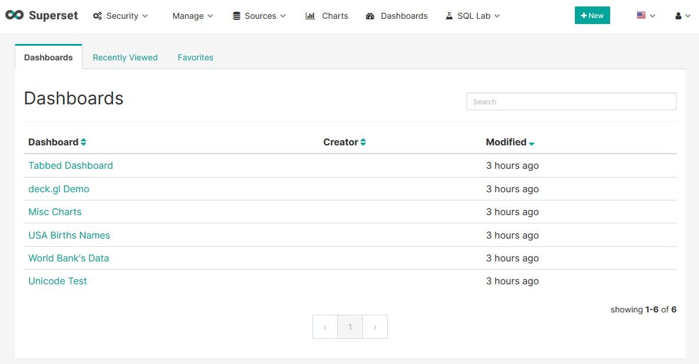

import Meta from './\_include/superset.md';

<Meta name="meta" />

## Getting Started {#guide}

### Initial Setup {#wizard}

1. After completing the installation of Superset in the **Websoft9 Console**, retrieve the application's **Overview** and **Access** information from **My Apps**.

2. Access the login page through your browser.

3. Enter your account and log in to the Superset backend.  
   

### Analyzing Data

1. After logging in to Superset, open the **Datasets** page and create a new database connection.

2. Once the connection is successful, the system will import the database tables.

3. Start analyzing the data.

## Configuration Options {#configs}

- Multilingual (✅): Supports background switching.
- CLI: `superset [OPTIONS] COMMAND [ARGS]...`
- [Configuration file](https://github.com/apache/superset/blob/master/superset/config.py): `./src/docker/pythonpath_dev/superset_config.py`
- SMTP (✅): Add the following SMTP configuration segment to the configuration file and restart the application for it to take effect.
  ```python
  # SMTP server configuration
  EMAIL_NOTIFICATIONS = True  # Enable email notifications
  SMTP_HOST = 'smtp.163.com'
  SMTP_STARTTLS = True
  SMTP_SSL = True
  SMTP_USER = 'websoft9@163.com'
  SMTP_PORT = 465
  SMTP_PASSWORD = '#wwBJ8'
  SMTP_MAIL_FROM = 'websoft9@163.com'
  ```

## Administration {#administrator}

- Replacement of Logo: Replace the container file located at `/app/superset/static/assets/images/superset-logo-horiz.png`.
- Password Recovery: Run the following SQL statement in the Superset database to reset the password for the user `admin` to `admin123`.
  ```sql
  UPDATE ab_user
  SET password='pbkdf2:sha256:150000$w8vfDHis$b9c8fa353137417946766ed87cf20510da7e1e3a7b79eef37426330abef552bf'
  WHERE username='admin';
  ```
- Install Database Driver: Superset needs to install a [database driver](https://superset.apache.org/docs/databases/installing-database-drivers) in the container to connect to the corresponding database.

  ```bash
  # Example: Installing the MySQL driver
  pip install mysqlclient

  # Example: Installing the PostgreSQL driver
  pip install psycopg2

  # Example: Installing the PostgreSQL driver via the pip mirror repository to resolve slow network issues
  pip install psycopg2 -i https://pypi.tuna.tsinghua.edu.cn/simple
  ```

## Troubleshooting {#troubleshooting}

#### Superset Container Installation Driver Error?

**Description**: ERROR: Could not install packages due to an OSError: [Errno 13]
Check the permissions.

**Reason**: Insufficient permissions.

**Solution**: Enter the container command mode as `root` and install the driver.
