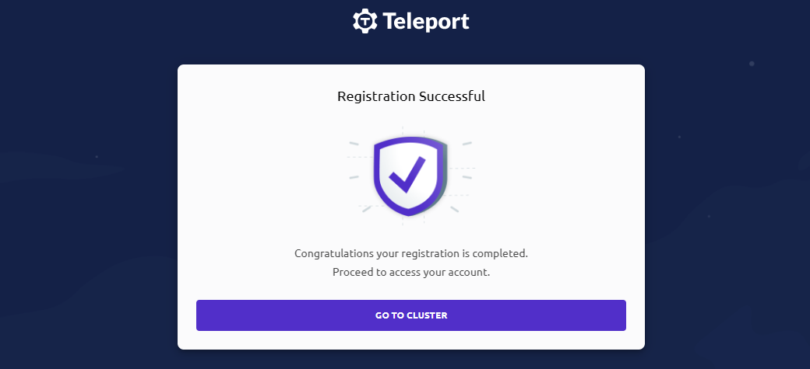
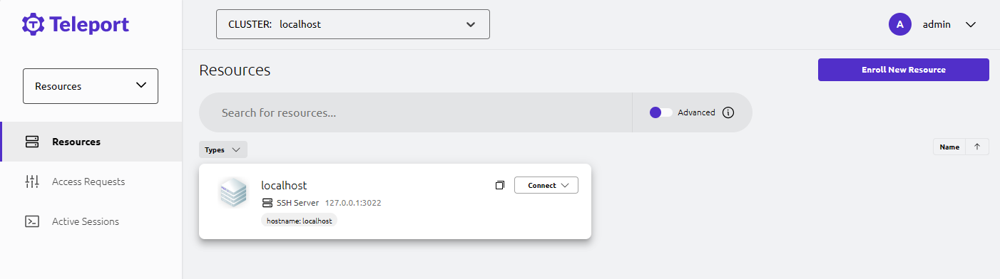
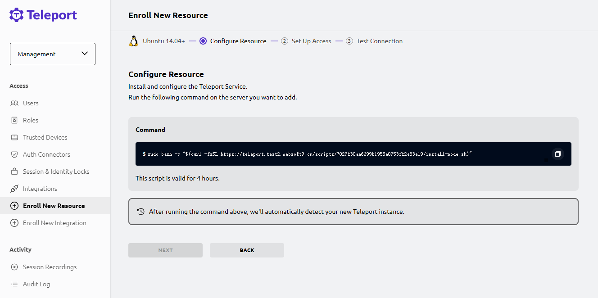
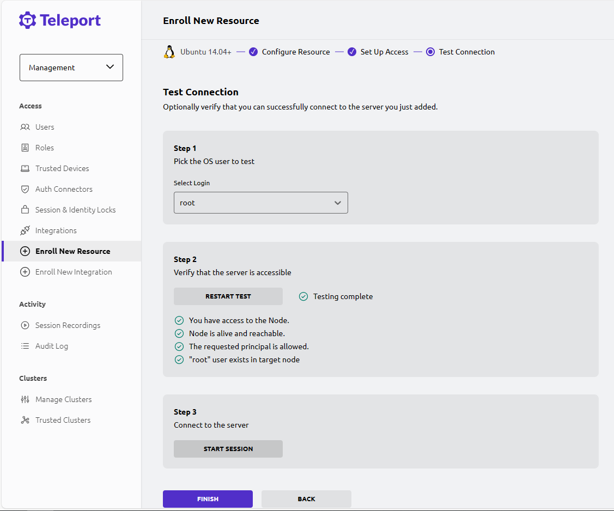

import Meta from './\_include/teleport.md';

<Meta name="meta" />

## Getting Started {#guide}

### Follow Up Steps for Installation (Necessary) {#create-user}

After installing Teleport on the **Websoft9 console**, the following steps need to be completed to log in to the backend:

1. Ensure a domain is set for Teleport and HTTPS access is enabled (**Required**).

2. Modify the Teleport configuration file's _public-addr_ configuration item to your real domain name (keeping port 443), and rebuild the application:

   ```
   public_addr:
      - 'example.domain.com:443'
   ```

3. Run the following command in the Teleport container to create a super user and generate a registration link (URL):

   ```
   tctl users add admin --roles=editor,auditor,access --logins=root,ubuntu,ec2-user
   ```

   > `logins=root,ubuntu,ec2-user` are required, otherwise you will not be able to connect to the managed Linux later on.

4. Run the registration link in a local browser to complete the password setup.

   > If the link is inaccessible or unsuccessful, it indicates that steps 1-2 have not been completed, or there is an issue.

   

5. Use the credentials to log in to the Teleport console.

   

### Manage Resources

#### Connecting to Remote Linux

1. Log in to the Teleport console, select **Resource > Enroll New Resource**.

2. Select an operating system and generate a client installation link.

   

3. Log in to the remote Linux server, and copy the previous link for client installation.

4. After the client is successfully installed, return to the Teleport console. Teleport will automatically detect the client and prompt the user to follow the wizard to complete the next steps.

   

## Configuration Options {#configs}

- Configuration file in the Teleport container (mounted to the src directory): `/etc/config/teleport.yaml`
- Multilingual (x)
- IP:Port access method (x): Not supported because self-generated certificates are not secure.
- Two-factor authentication: Websoft9 has disabled two-factor authentication in the Teleport configuration file.

## Administration {#administrator}

## Troubleshooting {#troubleshooting}

#### After filling in the password, registration still failed?

Ensure that the registration link is accessed through HTTPS.

#### Failed to connect to the server by IP:Port?

**Details**: When adding resources, running the installation command on the connected server may result in a curl failure.  
**Reason**: The self-signed certificate has been identified as insecure, and the connection is not allowed.  
**Solution**: Configure a domain name for Teleport and apply for a public certificate.
